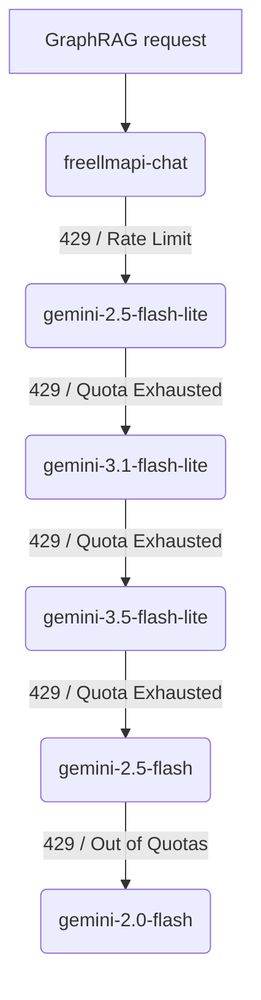

# Google Gemini & GraphRAG Integration Guide

This guide details how this repository integrates Google Gemini with Microsoft GraphRAG, including our high-performance fallback strategy, structured resume parsing, and rule-based ATS resume generation.

---

## 1. Gemini Model Configuration & Quotas

We utilize the **Google AI Studio Free Tier** alongside FreeLLMAPI / OpenRouter to build and query the knowledge graph. The free tier provides separate quotas *per model name*:

| Model | ID in API | Daily Quota (RPD) | Per-Minute Quota (RPM) | Status / Notes |
| :--- | :--- | :--- | :--- | :--- |
| **FreeLLMAPI Chat** | `freellmapi-chat` | Unlimited | Dynamic | ✅ **Primary Chat Model (OpenRouter Pool)** |
| **Gemini 2.5 Flash-Lite** | `gemini-2.5-flash-lite` | 1,500 | 15 | ✅ **Active Fallback (High Quota)** |
| **Gemini 3.1 Flash-Lite** | `gemini-3.1-flash-lite` | 1,500 | 15 | ✅ **Active Fallback (High Quota)** |
| **Gemini 3.5 Flash-Lite** | `gemini-3.5-flash-lite` | 1,500 | 15 | ✅ **Active Fallback (High Quota)** |
| **Gemini 2.5 Flash** | `gemini-2.5-flash` | 20 | 15 | Secondary Fallback |
| **Gemini 2.0 Flash** | `gemini-2.0-flash` | 20 | 15 | Secondary Fallback |
| **Nvidia Nemotron Embed** | `llama-nemotron-embed-vl-1b-v2` | Unlimited | Dynamic | ✅ **Primary Embedding Model** |
| **Gemini Embedding** | `gemini-embedding-001` | 1,500 | 15 | ✅ **Embedding Fallback** |

---

## 2. Multi-Model Fallback Architecture

To handle rate limits (RPM) and daily exhaustion (RPD) without stalling the indexer, we run a local **LiteLLM Proxy** on port `8002` configured via [`config/litellm-config.yaml`](file:///C:/Users/mamat/Github/Prasad-Resumes-GraphRAG/config/litellm-config.yaml).

### Fallback Order for Chat/Completions:


1. **`freellmapi-chat`** — Primary chat model routing to OpenRouter free models pool.
2. **`gemini-2.5-flash-lite`** — 1,500 RPD primary fallback.
3. **`gemini-3.1-flash-lite`** — 1,500 RPD secondary fallback.
4. **`gemini-3.5-flash-lite`** — 1,500 RPD tertiary fallback.
5. **`gemini-2.5-flash`** / **`gemini-2.0-flash`** — Final low-quota fallbacks.

---

## 3. Structured Resume Parsing & Tailoring Engine

Before GraphRAG processes the inputs, [`src/converters/`](file:///C:/Users/mamat/Github/Prasad-Resumes-GraphRAG/src/converters) extracts and structures raw data into [`input/MASTER_RESUME.txt`](file:///C:/Users/mamat/Github/Prasad-Resumes-GraphRAG/input/MASTER_RESUME.txt).

The [`src/generators/`](file:///C:/Users/mamat/Github/Prasad-Resumes-GraphRAG/src/generators) package provides automated ATS tailoring and rule-based PDF generation:
- **`ats_matcher.py`**: Performs ATS keyword analysis against job descriptions.
- **`resume_generator.py`**: Assembles `raw_resume.txt` with bold keyword marking (<20% bold character cap, max 3 phrases/bullet).
- **`pdf_renderer.py` & `pdf_styles.py`**: Renders candidate-agnostic, standard PDF resumes (`Prasad_Rane_Resume.pdf`) meeting strict page budget (2-page max), tight margins (`0.55"` left/right, `0.45"` top/bottom), KeepTogether job blocks, and clickable contact links.

---

## 4. Vercel Serverless Gateway Architecture

For deployment on serverless platforms like **Vercel Free Tier** where long-running local proxy background processes are unsupported, the application uses the **`src/gateway/` package**:

- **Provider-Driven Routing:** Three self-contained provider classes (`AlibabaProvider`, `OpenRouterProvider`, `GeminiProvider`) orchestrated by `facade.py` with `_try_chain` failover. Provider selection via `src/config/providers.py` registry (`CHAT_PROVIDER`, `RESUME_PROVIDER`, `EMBEDDING_PROVIDER` env vars).
- **Direct Gemini AI Studio API:** Uses `GEMINI_API_KEY` via direct Google REST endpoints (`generateContent`, `streamGenerateContent`, `embedContent`) as one of three providers.
- **Fast Static Graph Reader:** Uses `src/query/static_graph_reader.py` to query pre-indexed graph entities within < 1 second serverless execution budget.

The old `src/query/serverless_gateway.py` is a deprecated re-export shim (~30 lines) that delegates to `src.gateway` — kept for backward compatibility.

---

## 5. Operational Commands

### Query Codebase Knowledge Graph (Graphify - Default Agent Orientation)
```powershell
python -m graphify query "<natural language question or symbol>"
# Update codebase graph after making changes:
python -m graphify --update
```

### Start LiteLLM Proxy (Port 8002)
```powershell
python scripts/run_litellm.py
```

### Build GraphRAG Index
```powershell
python -m graphrag index --root .
```

### Run Knowledge Graph Queries
```powershell
python src/cli.py query --mode local "What AWS technologies did Prasad use?"
```

### Generate Tailored Raw & PDF Resume
```powershell
python src/cli.py generate --company <Company_Name> --jd-file <Path_To_JD.txt>
```

### Launch Minimalist Web UI
```powershell
python src/cli.py ui
# Runs `vercel dev` under the hood on port 3000 (matches production path)
```
