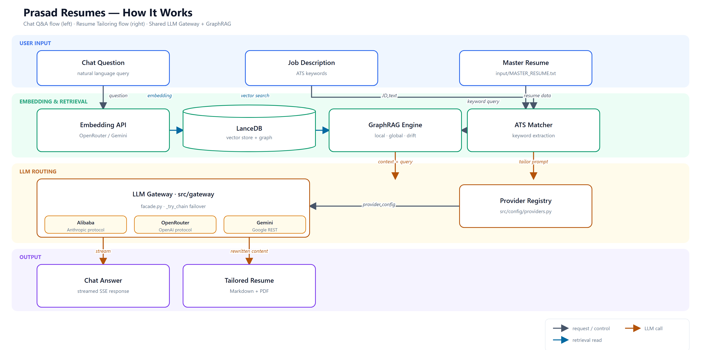

# Prasad Resumes - GraphRAG Knowledge Graph & Tailored Resume Generator

GraphRAG knowledge graph engine and automated ATS resume generator built over Prasad Rane's master resume and story bank content. Powered primarily by **OpenRouter API** (with direct Google Gemini AI Studio API fallback).

---

## Architecture & System Data Flow



<details>
<summary><b>Click to expand detailed system pipeline workflow specification</b></summary>

1. **Input Preprocessing (`src/converters/`):** Parses raw input documents into canonical [`input/MASTER_RESUME.txt`](file:///C:/Users/mamat/Github/Prasad-Resumes-GraphRAG/input/MASTER_RESUME.txt) & [`03-Story-Bank.txt`](file:///C:/Users/mamat/Github/Prasad-Resumes-GraphRAG/input/03-Story-Bank.txt).
2. **GraphRAG Indexing Engine (`graphrag index`):** Extracts entities, relationships, communities, and stores embeddings in LanceDB (`output/lancedb`) & Parquet tables.
3. **Primary LLM Gateway (`src/query/serverless_gateway.py`):** Routes requests primarily to **OpenRouter API**, with automatic failover & model rotation across **Google Gemini AI Studio API** (`gemini-2.5-flash-lite`, `gemini-2.0-flash`, `gemini-1.5-flash`).
4. **GraphRAG Pre-Retrieval & Tailored Resume Generator (`src/generators/`):** Performs local NLP & GraphRAG node pre-retrieval, adapts executive summary variants, reorders skills by JD relevance, bolds keywords (<20% cap), excludes title headers, and renders standard 2-page ATS PDFs (`Prasad_Rane_Resume.pdf`).
5. **FastAPI Web UI & Serverless Gateway (`src/web/` & `api/index.py`):** Single-page Material Design 3 interface featuring ATS Resume Tailoring, instant raw content markdown editor, and interactive GraphRAG Q&A Chatbot.

</details>

---

## Key Features

### 1. REAL ATS Resume Tailoring Engine (Zero Resume Shrinking)
- **Dynamic NLP Keyword & Technology Extraction**: Dynamically extracts specialized tools, cloud services, frameworks, and domain competencies from target job descriptions (*CrowdStrike*, *Falcon*, *AWS ECS Fargate*, *Amazon Bedrock*, *Kafka*, *OAuth2*, *Dynatrace*, *Single-Table DynamoDB*).
- **Dynamic Executive Summary Adaptation**: Scores candidate domain summary variants (*AI/LLM-Forward*, *Cloud & Reliability-Forward*, *Platform & DevEx-Forward*, *Security & Auth-Forward*) against JD requirements to select and adapt the best-matching summary.
- **Skill Category Prioritization**: Reorders technical skill categories dynamically so the categories most relevant to the JD appear first (without dropping any skills).
- **Precision Keyword Bolding**: Highlights JD-matched technical terms across summary, experience bullets, and skills section adhering to ATS <20% bold character caps.
- **Clean Header (Title Excluded)**: Completely omits default title header lines for clean, professional presentation flowing from candidate contact info directly into the Executive Summary.
- **Full 2-Page Budget Guarantee**: Preserves full bullet counts and complete career history across all 4 companies (Rocket Mortgage, London Computer Systems, EXFO, Tanish Infotech).

### 2. Interactive Preview Drawer & Raw Content Editor
- View rendered PDF previews side-by-side with an instant raw Markdown text editor.
- **Stateful In-Memory Editing**: No delay or infinite loading state when clicking *"Edit Raw Content"*.
- **Save & Re-render PDF**: Edit raw markdown directly in the UI drawer and re-render standard ATS PDFs in one click.

### 3. GraphRAG AI Chatbot (Ask Me Questions)
- Interactive Q&A interface powered by Prasad's GraphRAG knowledge graph and static resume search engine.
- **Purpose-Built Dual Query Modes**:
  - **Local Context**: Granular entity facts, exact project metrics (e.g. 70% Bedrock speedup, 40% Fargate cost reduction), company-by-company project details.
  - **Global Summary**: Synthesized executive career overviews, 10+ year trajectory pillars, cloud/AI migration milestones, and overarching technical leadership themes.
- Formatted Markdown responses with bullet lists, bold highlights, code blocks, clear chat reset, sample question action chips, and one-click copy to clipboard.

### 4. Vercel Serverless & Read-Only File System Resilience
- Fully resilient to serverless read-only filesystems (`/var/task`), automatically redirecting output directory creation to `/tmp/output`.
- Serves PDFs via inline data URIs and harmonizes API routes (`/api/generate`, `/api/render_pdf`, `/api/save-edit`, `/api/query`) across local servers and Vercel deployments.

---

## Configuration & Environment Variables

Create a `.env` file in the project root directory:

```env
# Primary LLM Provider (OpenRouter API)
OPENROUTER_API_KEY=sk-or-v1-your_openrouter_api_key_here

# Fallback LLM Provider (Google Gemini AI Studio API)
GEMINI_API_KEY=your_gemini_api_key_here

# GraphRAG Indexer (points at Gemini via LiteLLM proxy)
GRAPHRAG_API_KEY=your_gemini_api_key_here

# FreeLLMAPI (primary model in settings.yaml, routed via LiteLLM proxy)
FREELLMAPI_API_KEY=your_freellmapi_api_key_here
```

---

## Quick Start Setup

### 1. Activate Virtual Environment
```powershell
.\venv\Scripts\Activate.ps1
```

### 2. Start LiteLLM Proxy (required for GraphRAG indexing)
```powershell
python src/cli.py proxy
```
The proxy runs on port 8002 and routes `freellmapi-chat` → OpenRouter/Gemini fallback chain.

### 3. Launch Web UI (FastAPI Server)
```powershell
python src/cli.py ui
# Or directly: python scripts/run_ui.py
```
Open **http://127.0.0.1:8000** in your browser.

### 4. Generate Tailored Resume via CLI
```powershell
python src/cli.py generate --company <Company_Name> --jd-file <Path_To_JD.txt>
```

### 5. Query Knowledge Graph via CLI
```powershell
python src/cli.py query --mode local "What AWS technologies did Prasad use?"
```

### 6. Build or Re-Index Knowledge Graph
```powershell
python -m graphrag index --root .
```

### 7. Run Unit Test Suite
```powershell
.\venv\Scripts\python.exe -m unittest discover tests
```

---

## Vercel Serverless Deployment

Deploy to **Vercel Free Tier** using FastAPI (`api/index.py`):

```powershell
vercel --prod
```

Ensure `OPENROUTER_API_KEY` and `GEMINI_API_KEY` are configured in Vercel project environment variables.

---

## API Reference

All endpoints are available on both the local server (`src/web/app.py`, port 8000) and Vercel (`api/index.py`).

| Method | Path | Description |
|--------|------|-------------|
| `GET` | `/` | Web UI (local only) |
| `POST` | `/api/generate` | Generate tailored resume from company + JD text |
| `POST` | `/api/render_pdf` | Render PDF from raw resume markdown |
| `POST` | `/api/save-edit` | Save edited raw resume and re-render |
| `POST` | `/api/query` | GraphRAG Q&A query |
| `POST` | `/api/chat-stream` | Streaming chatbot (SSE) |
| `GET` | `/api/default-resume` | Get default master resume content |
| `GET` | `/output/{path}` | Serve generated PDFs (local only) |

---

## Troubleshooting

| Symptom | Cause | Fix |
|---------|-------|-----|
| `graphrag index` fails with connection error | LiteLLM proxy not running | Start it: `python src/cli.py proxy` |
| Chatbot returns raw entity dump, no LLM synthesis | Missing `OPENROUTER_API_KEY` and `GEMINI_API_KEY` | Add at least one to `.env` |
| `Address already in use: 8000` | Another process on port 8000 | Kill it or use `python src/cli.py ui --port 8001` |
| `Address already in use: 8002` | LiteLLM proxy already running | Use the existing instance |
| PDF not generated on Vercel | Read-only filesystem | Output is auto-redirected to `/tmp/output` — check Vercel function logs |
