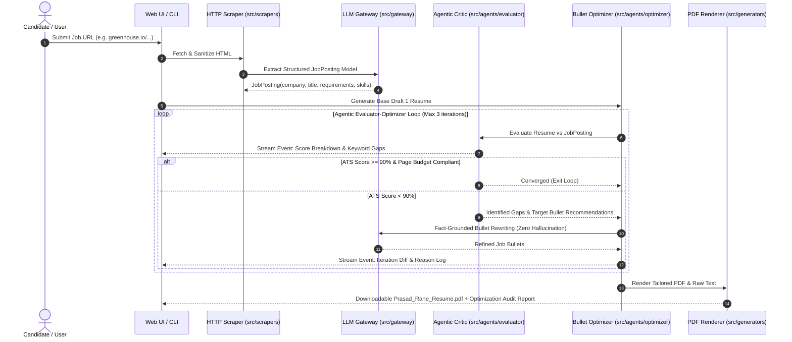

# Design Specification: Agentic Job Posting Ingestion & Evaluator-Optimizer Engine

> **Full Specification Document**: [`docs/superpowers/specs/2026-08-19-agentic-job-ingestion-and-resume-optimizer-design.md`](file:///C:/Users/mamat/Github/Prasad-Resumes-GraphRAG/docs/superpowers/specs/2026-08-19-agentic-job-ingestion-and-resume-optimizer-design.md)

---

## Summary of Planned Architecture

## Key Capabilities

1. **Job Ingestion Engine (`src/scrapers/`)**: Scrapes job postings directly from URLs (Greenhouse, Lever, Ashby, Workable, etc.) and uses LLM gateway structured extraction into a typed `JobPosting` model.
2. **Autonomous Evaluator-Optimizer Agent (`src/agents/`)**: Multi-step Critic-Refiner loop that scores keyword alignment, impact metrics, bolding density (<20%), and 2-page budget, iteratively rewriting bullets until ATS score >= 90%.
3. **Live Streaming UI/UX (`api/index.py` & Web UI)**: Real-time Server-Sent Events (SSE) stream displaying live thinking logs, pulsing status badges, animated metric radial gauges, and before/after iteration diffs.
4. **CLI Integration (`src/cli.py`)**: `python src/cli.py generate --url <JOB_URL> --agentic` with animated Rich terminal interface.
5. **Anti-Hallucination Guardrails**: Strictly grounds all rewrites in candidate facts from `input/MASTER_RESUME.txt` and the GraphRAG graph.
