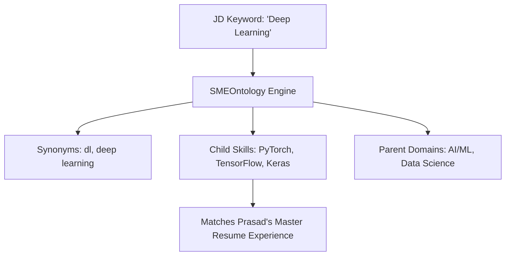
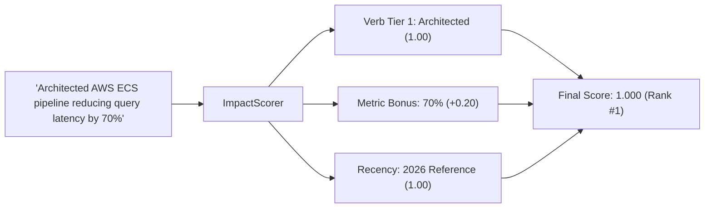
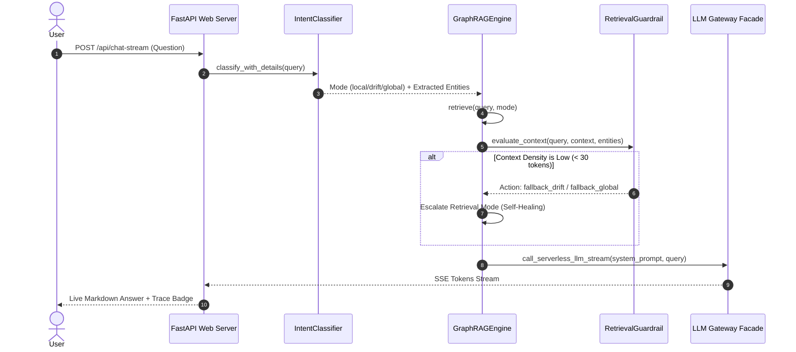

# How It Works: Knowledge Graph, Embeddings, Multi-Agent Guardrails & LLMs in This Project

This document details how **Vector Embeddings**, **Microsoft GraphRAG**, **SME Technology Ontologies**, **Action-Verb Impact Scoring**, **Self-Healing Guardrails**, and **Multi-Provider LLMs** operate together in the Prasad Resumes GraphRAG platform.

---

## Table of Contents

1. [Core Architectural Concepts](#core-architectural-concepts)
2. [SME Technology Ontology & Taxonomy](#sme-technology-ontology--taxonomy)
3. [Action-Verb Impact Scoring & Recency Decay](#action-verb-impact-scoring--recency-decay)
4. [Conversational Q&A & Self-Healing Guardrail Flow](#conversational-qa--self-healing-guardrail-flow)
5. [ATS Resume Tailoring Flow](#ats-resume-tailoring-flow)
6. [Synthetic Benchmark Evaluation Harness](#synthetic-benchmark-evaluation-harness)
7. [Multimodal Voice Assistant & UI](#multimodal-voice-assistant--ui)
8. [Key Modules & File Reference](#key-modules--file-reference)

---

## 1. Core Architectural Concepts

### 1. Vector Embeddings
- **Purpose:** Converts textual questions and resume text units into dense 1536-dimensional float vectors that capture semantic meaning.
- **In this project:** Questions and resume text units are indexed in **LanceDB**. When a query arrives, vector distance retrieves the most semantically relevant text units.

### 2. Microsoft GraphRAG (Knowledge Graph)
- **Purpose:** Connects entities (`Prasad Rane`, `AWS ECS Fargate`, `Rocket Mortgage`, `Kafka`, `FastAPI`) via rich relationships.
- **In this project:** Indexes master resumes and the 85KB story bank into entities, relationships, text units, and hierarchical community reports stored in Parquet tables.

### 3. Serverless Multi-Provider LLM Gateway
- **Purpose:** Generates answers and adapts executive summaries without vendor lock-in.
- **In this project:** Uses `facade.py` to route across **Alibaba Cloud Token Plan** (`qwen3.6/3.7`), **OpenRouter** (`openai/text-embedding-3-small`), and direct **Google Gemini AI Studio API** with automatic failover (`_try_chain`).

---

## 2. SME Technology Ontology & Taxonomy

**File:** [`src/generators/sme_ontology.py`](file:///c:/Users/mamat/Github/Prasad-Resumes-GraphRAG/src/generators/sme_ontology.py)

Candidate resumes rarely match job descriptions verbatim. A JD asking for *"Event-Driven Architecture"* or *"Deep Learning Frameworks"* requires semantic bridge matching to *"Kafka"* or *"PyTorch"*.



### Key Capabilities:
- **Synonym Normalization:** Canonicalizes variations like `k8s` $\rightarrow$ `kubernetes`, `postgres` $\rightarrow$ `postgresql`, `py-torch` $\rightarrow$ `pytorch`, `fast-api` $\rightarrow$ `fastapi`.
- **Category-to-Children Expansion:** Expands high-level requirements into concrete tools.
- **Bidirectional Relatedness Check:** Verifies whether two technical terms belong to the same technical taxonomy.

---

## 3. Action-Verb Impact Scoring & Recency Decay

**File:** [`src/generators/scoring.py`](file:///c:/Users/mamat/Github/Prasad-Resumes-GraphRAG/src/generators/scoring.py)

To comply with **EEOC** and **EU AI Act** requirements for explainable candidate evaluation, ranking uses a deterministic, parameterized formula rather than black-box graph embeddings:

$$W_{(c,s)} = \alpha \cdot \text{DurationScore} + \beta \cdot \text{RecencyScore} + \gamma \cdot \text{ImpactScore}$$



### Scoring Components:
1. **Bloom's Taxonomy / Action-Verb Tiering:**
   - **Tier 1 ($1.0$):** *Architected, Spearheaded, Engineered, Orchestrated, Pioneered, Founded*
   - **Tier 2 ($0.7$):** *Implemented, Developed, Built, Optimized, Migrated, Scaled, Delivered*
   - **Tier 3 ($0.4$):** *Maintained, Supported, Assisted, Monitored, Updated, Documented*
2. **Quantified Impact Detection:** Detects percentages (`70%`), currency (`$400K`), latency improvements (`50ms`, `3.5x`), and scale indicators (`10M requests`).
3. **Exponential Recency Decay:** Applies $e^{-\lambda \cdot \Delta t}$ with $\lambda = 0.15$, prioritizing recent achievements while preserving full career history.

---

## 4. Conversational Q&A & Self-Healing Guardrail Flow

When a user submits a question (via text or speech), the system follows this multi-stage execution pipeline:



---

## 5. ATS Resume Tailoring Flow

When tailoring a resume for a specific target company:

1. **ATS Keyword Extraction:** `ats_matcher.extract_ats_keywords(jd_text, expand_ontology=True)` extracts direct keywords and expands domain terms via `SMEOntology`.
2. **Candidate Bullet Ranking:** `rank_experience_bullets()` scores every bullet from `MASTER_RESUME.txt` using `ImpactScorer`.
3. **LLM Executive Summary Synthesis:** Dynamically adapts domain summaries (*AI/LLM-Forward*, *Cloud-Forward*, *Platform-Forward*, *Security-Forward*) to mirror JD priorities.
4. **Precision Keyword Bolding:** Highlights JD-matched technical terms while strictly maintaining $<20\%$ bold character ratio.
5. **ReportLab PDF Rendering:** Compiles `raw_resume.txt` into `Prasad_Rane_Resume.pdf`, enforcing tight margins (`0.55"` left/right, `0.45"` top/bottom), KeepTogether job blocks, and a strict 2-page budget guarantee.

---

## 6. Synthetic Benchmark Evaluation Harness

**File:** [`src/observability/benchmark_eval.py`](file:///c:/Users/mamat/Github/Prasad-Resumes-GraphRAG/src/observability/benchmark_eval.py)

To measure retrieval accuracy quantitatively:
- **Metrics Tracked:**
  - **Context Precision:** $\frac{|\text{Retrieved Entities} \cap \text{Expected Entities}|}{|\text{Expected Entities}|}$
  - **Context Recall:** Token overlap between ground-truth reference facts and retrieved context.
  - **Faithfulness:** Ratio of generated claims directly supported by retrieved context.
  - **Execution Latency:** Retrieval and guardrail evaluation latency in milliseconds.
- **Execution Command:**
  ```powershell
  python src/cli.py benchmark --mode all
  ```
  Generates automated evaluation reports at [`output/benchmark_report.md`](file:///c:/Users/mamat/Github/Prasad-Resumes-GraphRAG/output/benchmark_report.md).

---

## 7. Multimodal Voice Assistant & UI

- **Speech-to-Text (Voice Queries):** Click the microphone button in the web search bar to speak questions. Uses the browser's `SpeechRecognition` API with real-time transcription and automatic submission.
- **Text-to-Speech (Audio Briefings):** Click the speaker button on any assistant answer to hear a synthesized audio briefing via `SpeechSynthesis`.
- **Reasoning & Guardrail Trace:** Expandable badge under assistant answers displaying query intent, retrieved graph entities, and self-healing recovery traces.

---

## 8. Key Modules & File Reference

| Module | File Path | Key Responsibilities |
| :--- | :--- | :--- |
| **SME Ontology** | [`src/generators/sme_ontology.py`](file:///c:/Users/mamat/Github/Prasad-Resumes-GraphRAG/src/generators/sme_ontology.py) | Tech hierarchy, synonym dictionary, child/parent expansion |
| **Impact Scorer** | [`src/generators/scoring.py`](file:///c:/Users/mamat/Github/Prasad-Resumes-GraphRAG/src/generators/scoring.py) | Action-verb tiers, metric bonuses, recency decay |
| **ATS Matcher** | [`src/generators/ats_matcher.py`](file:///c:/Users/mamat/Github/Prasad-Resumes-GraphRAG/src/generators/ats_matcher.py) | JD keyword extraction, bullet ranking |
| **Resume Generator** | [`src/generators/resume_generator.py`](file:///c:/Users/mamat/Github/Prasad-Resumes-GraphRAG/src/generators/resume_generator.py) | Resume assembly, keyword bolding (<20% cap) |
| **PDF Renderer** | [`src/generators/pdf_renderer.py`](file:///c:/Users/mamat/Github/Prasad-Resumes-GraphRAG/src/generators/pdf_renderer.py) | ReportLab PDF compilation, 2-page budget layout |
| **Intent Router** | [`src/query/intent_classifier.py`](file:///c:/Users/mamat/Github/Prasad-Resumes-GraphRAG/src/query/intent_classifier.py) | Query intent taxonomy, entity recognition |
| **Retrieval Guardrail** | [`src/query/retrieval_guardrail.py`](file:///c:/Users/mamat/Github/Prasad-Resumes-GraphRAG/src/query/retrieval_guardrail.py) | Pre-synthesis context evaluation & mode escalation |
| **GraphRAG Engine** | [`src/query/graphrag_engine.py`](file:///c:/Users/mamat/Github/Prasad-Resumes-GraphRAG/src/query/graphrag_engine.py) | LanceDB vector search, Parquet graph reader, SSE stream |
| **LLM Gateway** | [`src/gateway/facade.py`](file:///c:/Users/mamat/Github/Prasad-Resumes-GraphRAG/src/gateway/facade.py) | Multi-provider failover (`_try_chain`) |
| **Evaluation Harness** | [`src/observability/benchmark_eval.py`](file:///c:/Users/mamat/Github/Prasad-Resumes-GraphRAG/src/observability/benchmark_eval.py) | Synthetic benchmark evaluation & report generation |
| **Web Server & UI** | [`src/web/app.py`](file:///c:/Users/mamat/Github/Prasad-Resumes-GraphRAG/src/web/app.py), [`src/web/static/app.js`](file:///c:/Users/mamat/Github/Prasad-Resumes-GraphRAG/src/web/static/app.js) | FastAPI routes, voice recognition, audio briefing |
