# PROJECT: Prasad Resumes — GraphRAG Knowledge Graph & Talent Analytics

**PURPOSE:** Multi-modal GraphRAG knowledge graph, automated ATS resume generator, and conversational talent analytics platform over master resume and story bank repositories.

**GENERATED:** 2026-08-15 | **LEVELS:** Earth (Project) → Continent (Subsystem) → Country (Feature Clusters) | **CONFIDENCE:** [Documented] [Inferred]

---

## 1. Project Overview (Earth Level)

**[Documented]**
This repository provides a dual-flow talent platform powered by **Microsoft GraphRAG 2.5**, **LanceDB vector databases**, **Serverless Multi-Provider LLM Routing** (Alibaba Cloud, OpenRouter, Google Gemini AI Studio), **SME Technology Ontologies**, **Action-Verb Impact Scoring**, and an interactive **FastAPI + Voice Multimodal Web Interface**.

**[Inferred]**
The system is architected around two primary decoupled execution pipelines that share a common knowledge and routing substrate:
1. **Conversational Talent Analytics Flow:** Natural language query $\rightarrow$ Intent classification & SME entity extraction $\rightarrow$ GraphRAG retrieval with autonomous self-healing guardrails $\rightarrow$ Multi-provider LLM streaming.
2. **ATS Resume Tailoring Flow:** Job Description (JD) text $\rightarrow$ Keyword & phrase extraction with hierarchical SME ontology expansion $\rightarrow$ Action-verb impact & recency decay scoring $\rightarrow$ LLM summary adaptation & bullet ranking $\rightarrow$ Pixel-perfect ATS PDF rendering adhering to a strict 2-page budget.

```mermaid
graph TD
    subgraph Ingestion ["Ingestion & Representation"]
        I1[Master Resumes & Story Bank] --> I2[Input Converter / PDF Parsers]
        I2 --> I3[(LanceDB Vector Store & Graph Parquet)]
    end

    subgraph ChatFlow ["Conversational Q&A Flow"]
        Q1[User / Voice Query] --> Q2[Intent Classifier & SME Router]
        Q2 --> Q3[GraphRAG Engine / Static Graph Reader]
        Q3 --> Q4{Retrieval Guardrail}
        Q4 -->|Sufficient| Q5[LLM Gateway Facade]
        Q4 -->|Low Density| Q6[Self-Healing Mode Escalation]
        Q6 --> Q3
        Q5 --> Q7[SSE Token Stream + Voice Audio Briefing]
    end

    subgraph ResumeFlow ["ATS Resume Tailoring Flow"]
        R1[Target Job Description] --> R2[ATS Matcher + SME Ontology]
        R2 --> R3[Action-Verb Impact & Recency Scorer]
        R3 --> R4[Resume Generator Engine]
        R4 --> R5[Rule-Based ReportLab PDF Renderer]
    end
```

---

## 2. Subsystem Map (Continents)

| # | Subsystem | Purpose | Key Modules | Confidence |
|---|-----------|---------|-------------|:---:|
| 1 | [**src/gateway**](src/gateway/README.md) | Multi-provider serverless LLM routing with fallback chains (`_try_chain`) | `facade.py`, `alibaba.py`, `openrouter.py`, `gemini.py`, `base.py` | [Documented] |
| 2 | [**src/query**](src/query/README.md) | GraphRAG multi-mode retrieval, zero-shot intent routing, and self-healing guardrails | `graphrag_engine.py`, `intent_classifier.py`, `retrieval_guardrail.py`, `static_graph_reader.py`, `search_engine.py` | [Documented] |
| 3 | [**src/generators**](src/generators/README.md) | ATS keyword matching, SME ontology expansion, action-verb impact scoring, and PDF generation | `sme_ontology.py`, `scoring.py`, `ats_matcher.py`, `resume_generator.py`, `pdf_renderer.py` | [Documented] |
| 4 | [**src/converters**](src/converters/README.md) | Multi-format resume parsing and structured markdown generation | `input_converter.py`, `pdf_parser.py`, `resume_structured_parser.py`, `resume_structurer.py` | [Documented] |
| 5 | [**src/observability**](src/observability/README.md) | Correlation tracking and synthetic RAG benchmark evaluation harness | `benchmark_eval.py`, `__init__.py` | [Documented] |
| 6 | [**src/web & shared**](src/web/README.md) | FastAPI serverless web application, voice assistant, and live preview drawer | `app.py`, `api_routes.py`, `api_models.py`, `app.js`, `index.html` | [Documented] |

---

## 3. Public API Routes

| Method | Path | Handler Function | Subsystem Docs | Description |
|--------|------|------------------|----------------|-------------|
| `GET` | `/` | `index_endpoint` | [src/web](src/web/README.md) | Serves the Material Design 3 single-page web UI |
| `POST` | `/api/generate` | `generate_resume_endpoint` | [src/generators](src/generators/README.md) | Tailors raw markdown & PDF resume against target JD |
| `POST` | `/api/render_pdf` | `render_pdf_endpoint` | [src/generators](src/generators/README.md) | Compiles raw markdown into standard ATS PDF |
| `POST` | `/api/save-edit` | `save_edit_endpoint` | [src/generators](src/generators/README.md) | Saves in-memory edited markdown and re-renders PDF |
| `POST` | `/api/query` | `query_endpoint` | [src/query](src/query/README.md) | Synchronous GraphRAG Q&A query endpoint |
| `POST` | `/api/chat-stream` | `chat_stream_endpoint` | [src/query](src/query/README.md) | Token-by-token SSE streaming with guardrail traces |
| `GET` | `/api/default-resume` | `default_resume_endpoint` | [src/web](src/web/README.md) | Retrieves pre-compiled master resume and PDF |

---

## 4. Primary Entry Points

| File / Command | Mode | Responsibility |
|----------------|------|----------------|
| `src/cli.py generate` | CLI | Tailor resume against company name and JD text/file |
| `src/cli.py query` | CLI | Query local or global knowledge graph via terminal |
| `src/cli.py benchmark` | CLI | Run synthetic evaluation harness and export markdown report |
| `src/cli.py proxy` | Service | Launch LiteLLM local fallback proxy on port 8002 |
| `src/cli.py ui` | Web | Launch local web application via `vercel dev` or `uvicorn` |
| `scripts/run_litellm.py` | Script | Wrapper for running LiteLLM multi-model proxy |
| `scripts/benchmark_eval.py` | Script | Direct benchmark execution runner |

---

## 5. Cross-Cutting Architectural Patterns

**[Documented]**
- **Serverless Zero-Server Footprint:** Designed to run seamlessly in stateless serverless environments (Vercel Free Tier) without persistent background processes or heavy database servers.
- **Failover Provider Architecture:** LLM calls gracefully degrade from Alibaba Token Plan (`qwen3.6/3.7`) $\rightarrow$ OpenRouter $\rightarrow$ Direct Google Gemini AI Studio REST endpoints.
- **Explainable Scoring over Black-Box GNNs:** Candidate ranking relies on Bloom's Taxonomy action-verb tiers, quantified impact detection, and exponential recency decay, ensuring compliance with EEOC and EU AI Act algorithmic transparency standards.
- **Strict TDD Protocol:** Every feature, parser, and engine module is validated with automated unit tests (367/367 tests passing).
