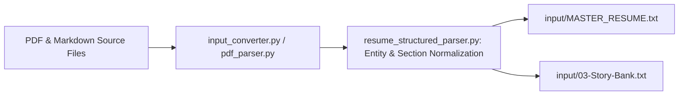

# SUBSYSTEM: src/converters — Ingestion & Document Conversion

**RESPONSIBILITY:** Ingests raw source resumes, PDFs, and Markdown story banks, extracts structured career entries, and standardizes data for GraphRAG indexing.

**LEVEL:** Continent (Subsystem) | **CONFIDENCE:** [Documented] [Inferred]

---

## 1. Subsystem Architecture

**[Documented]**
The Converters subsystem provides deterministic document parsing for PDF and Markdown files, normalizing candidate information into standardized `MASTER_RESUME.txt` and story bank units consumed by GraphRAG indexers and resume tailoring engines.

---

## 2. Feature Clusters & Modules

| File | Role / Responsibility | Confidence |
|------|-----------------------|:---:|
| [`input_converter.py`](file:///c:/Users/mamat/Github/Prasad-Resumes-GraphRAG/src/converters/input_converter.py) | Batch converts heterogeneous source directories into GraphRAG `input/` text assets. | [Documented] |
| [`pdf_parser.py`](file:///c:/Users/mamat/Github/Prasad-Resumes-GraphRAG/src/converters/pdf_parser.py) | Lightweight PDF text extraction layer wrapping `pypdf` with encoding sanitization. | [Documented] |
| [`resume_structured_parser.py`](file:///c:/Users/mamat/Github/Prasad-Resumes-GraphRAG/src/converters/resume_structured_parser.py) | Extracts structured sections (Experience, Education, Skills, Summary variants) into Pydantic models. | [Documented] |
| [`resume_structurer.py`](file:///c:/Users/mamat/Github/Prasad-Resumes-GraphRAG/src/converters/resume_structurer.py) | Helper routines formatting parsed candidate objects into canonical Markdown representation. | [Documented] |

---

## 3. Data Extraction Flow

**[Inferred]**
1. **Source Document Discovery:** Scans source directories for `.pdf` and `.md` resumes.
2. **Layout & Text Extraction:** Extracts clean text lines while normalizing Unicode characters, em-dashes (`—` $\rightarrow$ `-`), and bullet markers.
3. **Structured Entity Resolution:** Groups chronological company tenures, job titles, date ranges, and accomplishment bullets into deterministic `JobEntry` schemas.
4. **Canonical Master Export:** Writes clean, validated text to `input/MASTER_RESUME.txt` ensuring high indexing quality during `python -m graphrag index`.
