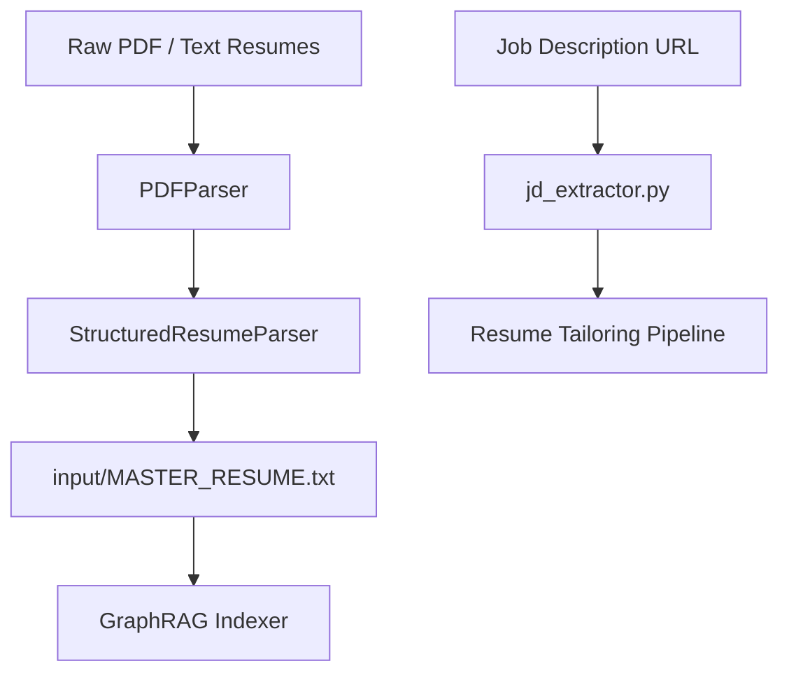

# Subsystem: `src/converters` (Continent Level)

**Responsibility:** Document parsing, text extraction, structured resume parsing, job description web scraping, and normalization into master knowledge graph inputs.

---

## 1. Overview & Responsibility

**[Documented]** `src/converters` handles extracting text from PDF resumes, raw text source files, and live Job Description URLs. It normalizes work experience, skills, and projects into structured JSON and Markdown artifacts (`input/MASTER_RESUME.txt`).

**[Inferred]** This subsystem forms the top of the data ingestion pipeline, transforming unstructured raw artifacts and web job postings into consistent representations before GraphRAG embedding, intent matching, and ATS tailoring.

---

## 2. Key Modules & Classes

| Module / Class | File | Responsibility |
|:---|:---|:---|
| [`jd_extractor`](file:///C:/Users/mamat/Github/Prasad-Resumes-GraphRAG/src/converters/jd_extractor.py) | `src/converters/jd_extractor.py` | Fetches, sanitizes, and extracts job descriptions and metadata from public career URLs (LinkedIn, Greenhouse, Lever, Indeed). |
| [`PDFParser`](file:///C:/Users/mamat/Github/Prasad-Resumes-GraphRAG/src/converters/pdf_parser.py) | `src/converters/pdf_parser.py` | Extracts text and layout metadata from PDF files using pdfplumber / pypdf. |
| [`StructuredResumeParser`](file:///C:/Users/mamat/Github/Prasad-Resumes-GraphRAG/src/converters/resume_structured_parser.py) | `src/converters/resume_structured_parser.py` | Parses raw resume text into structured Pydantic `ResumeData` representations. |
| `input_converter` | `src/converters/input_converter.py` | Converts input files into GraphRAG-ready chunked text formats. |
| `resume_structurer` | `src/converters/resume_structurer.py` | Structures messy resume text into clean markdown sections. |

---

## 3. Data Flow & Dependencies

