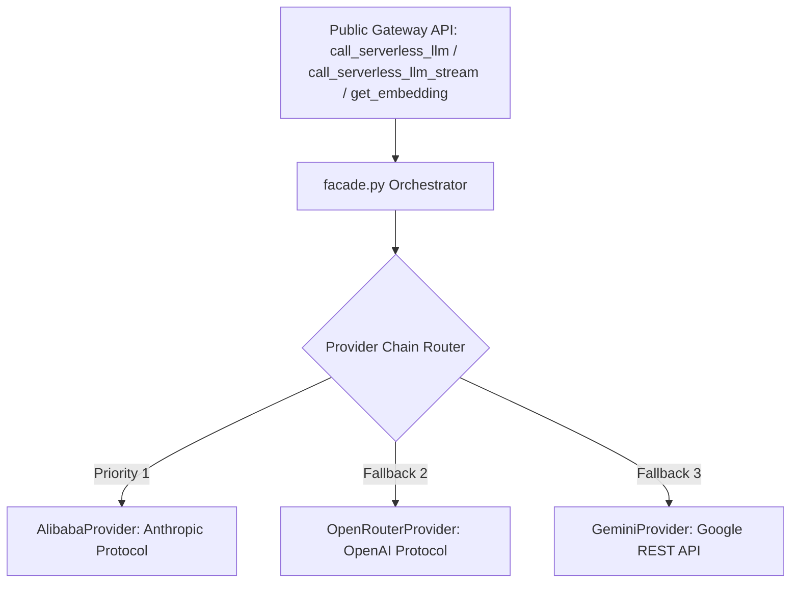

# SUBSYSTEM: src/gateway — Multi-Provider Serverless LLM Gateway

**RESPONSIBILITY:** Decouples the application from specific AI vendors by implementing a provider-agnostic LLM routing layer with automatic failover, protocol normalization, and connection pooling.

**LEVEL:** Continent (Subsystem) | **CONFIDENCE:** [Documented] [Inferred]

---

## 1. Subsystem Architecture

**[Documented]**
The Gateway wraps heterogeneous AI providers under a unified `BaseProvider` abstract interface and provides an orchestrating `facade.py` that handles provider instantiation, circuit caching, and dynamic failover routing (`_try_chain`).



---

## 2. Feature Clusters & Modules

| File | Role / Responsibility | Confidence |
|------|-----------------------|:---:|
| [`facade.py`](file:///c:/Users/mamat/Github/Prasad-Resumes-GraphRAG/src/gateway/facade.py) | Public entry-point functions (`call_serverless_llm`, `call_serverless_llm_stream`, `get_embedding`), provider registry resolution, and `_try_chain` error failover. | [Documented] |
| [`base.py`](file:///c:/Users/mamat/Github/Prasad-Resumes-GraphRAG/src/gateway/base.py) | Abstract base class `BaseProvider` defining `chat()`, `chat_stream()`, and `embed()`, with shared `aiohttp` connection management. | [Documented] |
| [`alibaba.py`](file:///c:/Users/mamat/Github/Prasad-Resumes-GraphRAG/src/gateway/alibaba.py) | Provider implementation for Alibaba Cloud Token Plan using Anthropic-compatible JSON payload formats. | [Documented] |
| [`openrouter.py`](file:///c:/Users/mamat/Github/Prasad-Resumes-GraphRAG/src/gateway/openrouter.py) | Provider implementation for OpenRouter using OpenAI-compatible completion and embedding formats. | [Documented] |
| [`gemini.py`](file:///c:/Users/mamat/Github/Prasad-Resumes-GraphRAG/src/gateway/gemini.py) | Direct Google AI Studio REST client calling `generateContent` and `embedContent` via `?key=` authentication. | [Documented] |
| [`__init__.py`](file:///c:/Users/mamat/Github/Prasad-Resumes-GraphRAG/src/gateway/__init__.py) | Package public API re-exports for clean modular imports. | [Documented] |

---

## 3. Public API Contract

```python
# Synchronous / Asynchronous completion call
async def call_serverless_llm(
    prompt: str,
    system_prompt: str = "",
    model: Optional[str] = None,
    temperature: float = 0.3,
    max_tokens: int = 4096,
) -> str

# SSE token streaming generator
async def call_serverless_llm_stream(
    system_prompt: str,
    user_message: str,
    temperature: float = 0.3,
) -> AsyncGenerator[str, None]

# Dense text embedding generator
async def get_embedding(text: str) -> List[float]
```

---

## 4. Key Implementation Nuances

**[Inferred]**
- **Protocol Adaptation:** Alibaba models expect an Anthropic-style message envelope (`/v1/messages`), OpenRouter models use OpenAI format (`/v1/chat/completions`), and Gemini uses Google's specialized `contents.parts` hierarchy. Each provider class handles full bi-directional protocol adaptation.
- **Failover Cascade:** When an API key is missing, network requests timeout, or rate limits (HTTP 429) trigger, `_try_chain` catches the exception, logs structured telemetry, and seamlessly promotes the next configured provider without dropping active user queries.
