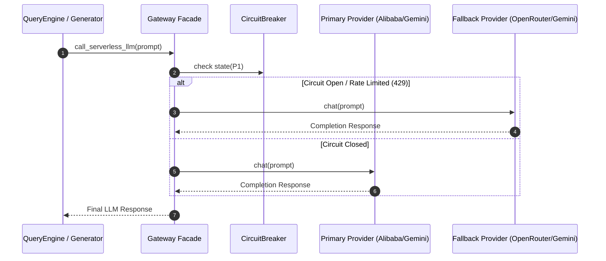

# Subsystem: `src/gateway` (Continent Level)

**Responsibility:** Multi-provider serverless LLM router, circuit breaking, failover orchestration, and streaming integration.

---

## 1. Overview & Responsibility

**[Documented]** `src/gateway` coordinates access to external LLM and embedding APIs. It implements an abstract `BaseProvider` interface with concrete implementations for Alibaba Cloud, Google Gemini, and OpenRouter, wrapped in a resilient failover chain (`_try_chain`) and circuit breaker pattern.

**[Inferred]** This subsystem completely isolates the rest of the application (GraphRAG engine, resume generators, API routes) from vendor-specific API structures, rate limits (HTTP 429), and quota exhaustion.

---

## 2. Key Modules & Classes

| Class / Module | File | Responsibility |
|:---|:---|:---|
| [`BaseProvider`](file:///C:/Users/mamat/Github/Prasad-Resumes-GraphRAG/src/gateway/base.py) | `src/gateway/base.py` | Abstract base class defining `chat()`, `chat_stream()`, and `embed()`. |
| [`CircuitBreaker`](file:///C:/Users/mamat/Github/Prasad-Resumes-GraphRAG/src/gateway/circuit_breaker.py) | `src/gateway/circuit_breaker.py` | State machine (CLOSED, OPEN, HALF_OPEN) preventing repeated calls to failing providers. |
| [`AlibabaProvider`](file:///C:/Users/mamat/Github/Prasad-Resumes-GraphRAG/src/gateway/alibaba.py) | `src/gateway/alibaba.py` | Adapter for Alibaba Cloud ModelStudio Qwen models via Anthropic-compatible API. |
| [`GeminiProvider`](file:///C:/Users/mamat/Github/Prasad-Resumes-GraphRAG/src/gateway/gemini.py) | `src/gateway/gemini.py` | Direct REST client for Google AI Studio Gemini API (`generateContent`, `streamGenerateContent`, `embedContent`). |
| [`OpenRouterProvider`](file:///C:/Users/mamat/Github/Prasad-Resumes-GraphRAG/src/gateway/openrouter.py) | `src/gateway/openrouter.py` | OpenAI-compatible adapter for OpenRouter completion and embedding models. |
| [`facade.py`](file:///C:/Users/mamat/Github/Prasad-Resumes-GraphRAG/src/gateway/facade.py) | `src/gateway/facade.py` | Orchestration facade exposing `call_serverless_llm`, `call_serverless_llm_stream`, and `get_embedding`. |

---

## 3. Failover Execution Flow

