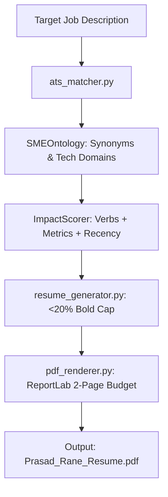

# Subsystem: `src/generators` (Continent Level)

**Responsibility:** ATS keyword matching, SME ontology expansion, impact scoring, tailored resume assembly, and ReportLab PDF compilation.

---

## 1. Overview & Responsibility

**[Documented]** `src/generators` is the core resume generation engine. It evaluates job descriptions, identifies required technical skills, expands terms via a specialized taxonomy (`SMEOntology`), scores candidate bullet achievements via `ImpactScorer`, highlights keywords with a strictly enforced $<20\%$ bold character budget, and renders pixel-perfect, 2-page max PDFs via ReportLab.

**[Inferred]** The pipeline is completely generic and candidate-agnostic, reading candidate identity and contact data dynamically from structured models (`ResumeData`, `JobEntry`).

---

## 2. Key Modules & Classes

| Module / Class | File | Responsibility |
|:---|:---|:---|
| [`SMEOntology`](file:///C:/Users/mamat/Github/Prasad-Resumes-GraphRAG/src/generators/sme_ontology.py) | `src/generators/sme_ontology.py` | Technical skill ontology, synonym normalization, parent/child taxonomy matching. |
| [`ImpactScorer`](file:///C:/Users/mamat/Github/Prasad-Resumes-GraphRAG/src/generators/scoring.py) | `src/generators/scoring.py` | Bloom's taxonomy action-verb scoring, quantified metric detection, and recency decay. |
| [`ats_matcher`](file:///C:/Users/mamat/Github/Prasad-Resumes-GraphRAG/src/generators/ats_matcher.py) | `src/generators/ats_matcher.py` | Extracts keywords from JDs, computes match scores, and ranks experience bullets. |
| [`resume_generator`](file:///C:/Users/mamat/Github/Prasad-Resumes-GraphRAG/src/generators/resume_generator.py) | `src/generators/resume_generator.py` | Assembles tailored markdown resume, coordinates LLM summary synthesis, applies bolding caps. |
| [`pdf_renderer`](file:///C:/Users/mamat/Github/Prasad-Resumes-GraphRAG/src/generators/pdf_renderer.py) | `src/generators/pdf_renderer.py` | Compiles raw text resume into standard ATS PDF with tight margins and KeepTogether blocks. |
| [`pdf_styles`](file:///C:/Users/mamat/Github/Prasad-Resumes-GraphRAG/src/generators/pdf_styles.py) | `src/generators/pdf_styles.py` | ReportLab style sheets, font metrics, two-pass `PageCountCanvas`, and layout constraints. |
| [`models.py`](file:///C:/Users/mamat/Github/Prasad-Resumes-GraphRAG/src/generators/models.py) | `src/generators/models.py` | Pydantic data schemas: `ResumeData`, `JobEntry`, `ProjectEntry`, `EducationEntry`. |

---

## 3. Resume Tailoring Workflow

