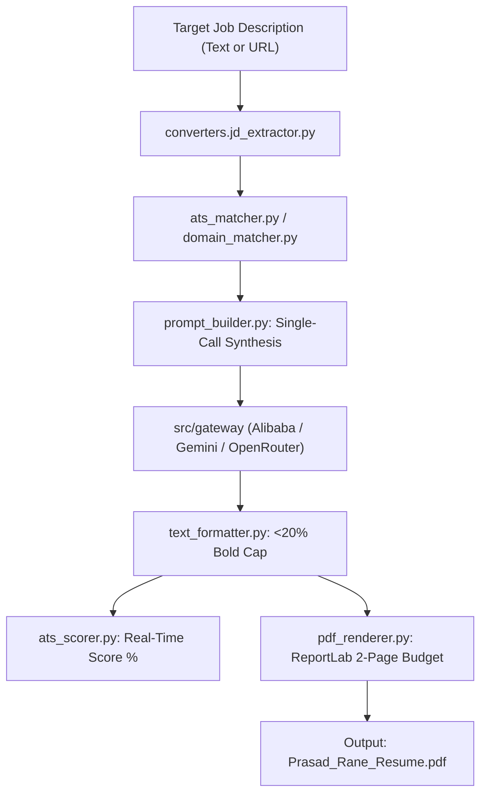

# Subsystem: `src/generators` (Continent Level)

**Responsibility:** ATS keyword matching, SME ontology expansion, impact scoring, real-time match analytics, tailored resume assembly, and ReportLab PDF compilation.

---

## 1. Overview & Responsibility

**[Documented]** `src/generators` is the core resume generation and ATS analytics engine. It evaluates job descriptions, identifies required technical skills, expands terms via a specialized taxonomy (`SMEOntology`), scores candidate bullet achievements via `ImpactScorer`, calculates real-time ATS match metrics (`ats_scorer.py`), highlights keywords with a strictly enforced $<20\%$ bold character budget, and renders pixel-perfect, 2-page max PDFs via ReportLab.

**[Inferred]** The package adheres strictly to the Single Responsibility Principle (SRP):
- High-level orchestration is managed by `resume_generator.py`.
- Domain classification and summary variant mapping are isolated in `domain_matcher.py`.
- Prompt templating, metric extraction, and LLM output decoding live in `prompt_builder.py`.
- Markdown layout, ATS bolding constraints, and semantic bullet scoring reside in `text_formatter.py`.
- Real-time ATS match scoring, section coverage, and suggestions are calculated by `ats_scorer.py`.

---

## 2. Key Modules & Classes

| Module / Class | File | Responsibility |
|:---|:---|:---|
| [`SMEOntology`](file:///C:/Users/mamat/Github/Prasad-Resumes-GraphRAG/src/generators/sme_ontology.py) | `src/generators/sme_ontology.py` | Technical skill ontology, synonym normalization, parent/child taxonomy matching. |
| [`ImpactScorer`](file:///C:/Users/mamat/Github/Prasad-Resumes-GraphRAG/src/generators/scoring.py) | `src/generators/scoring.py` | Bloom's taxonomy action-verb scoring, quantified metric detection, and recency decay. |
| [`ats_scorer`](file:///C:/Users/mamat/Github/Prasad-Resumes-GraphRAG/src/generators/ats_scorer.py) | `src/generators/ats_scorer.py` | Real-time ATS match percentage, keyword breakdown (skills/experience/summary), and actionable suggestions. |
| [`ats_matcher`](file:///C:/Users/mamat/Github/Prasad-Resumes-GraphRAG/src/generators/ats_matcher.py) | `src/generators/ats_matcher.py` | Extracts keywords from JDs and queries GraphRAG story banks for semantic evidence. |
| [`domain_matcher`](file:///C:/Users/mamat/Github/Prasad-Resumes-GraphRAG/src/generators/domain_matcher.py) | `src/generators/domain_matcher.py` | Evaluates JD terminology against domain categories (AI, Cloud, DevEx, Security) to pre-select summary variants. |
| [`prompt_builder`](file:///C:/Users/mamat/Github/Prasad-Resumes-GraphRAG/src/generators/prompt_builder.py) | `src/generators/prompt_builder.py` | Single-call prompt construction with GraphRAG achievements, gap-framing bridging notes, and metric regex extraction. |
| [`text_formatter`](file:///C:/Users/mamat/Github/Prasad-Resumes-GraphRAG/src/generators/text_formatter.py) | `src/generators/text_formatter.py` | ATS markdown formatting, bullet scoring, and $<20\%$ character bold budget enforcement. |
| [`resume_generator`](file:///C:/Users/mamat/Github/Prasad-Resumes-GraphRAG/src/generators/resume_generator.py) | `src/generators/resume_generator.py` | High-level generator orchestrator and stepwise generator pipeline. |
| [`pdf_renderer`](file:///C:/Users/mamat/Github/Prasad-Resumes-GraphRAG/src/generators/pdf_renderer.py) | `src/generators/pdf_renderer.py` | Compiles raw text resume into standard ATS PDF with tight margins and KeepTogether blocks. |
| [`pdf_styles`](file:///C:/Users/mamat/Github/Prasad-Resumes-GraphRAG/src/generators/pdf_styles.py) | `src/generators/pdf_styles.py` | ReportLab style sheets, font metrics, two-pass `PageCountCanvas`, and layout constraints. |
| [`models.py`](file:///C:/Users/mamat/Github/Prasad-Resumes-GraphRAG/src/generators/models.py) | `src/generators/models.py` | Pydantic data schemas: `ResumeData`, `JobEntry`, `ProjectEntry`, `EducationEntry`. |

---

## 3. Resume Tailoring Workflow

