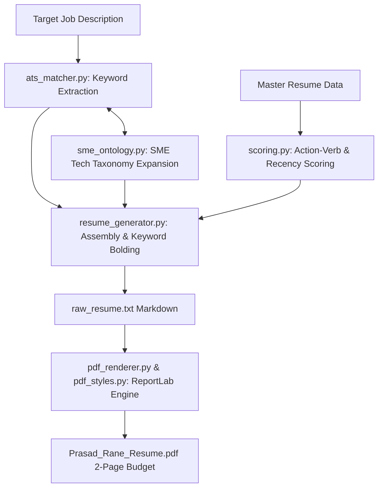

# SUBSYSTEM: src/generators — Resume Tailoring, SME Ontology, Scoring & PDF Engine

**RESPONSIBILITY:** Dynamically extracts ATS keywords from job descriptions, enriches with SME tech ontologies, scores experience bullets using Action-Verb impact and recency decay, and compiles standard 2-page ATS PDF resumes.

**LEVEL:** Continent (Subsystem) | **CONFIDENCE:** [Documented] [Inferred]

---

## 1. Subsystem Architecture

**[Documented]**
The Generators subsystem takes raw Job Descriptions, extracts technical keywords, resolves synonyms and parent categories via `SMEOntology`, scores master resume bullets via `ImpactScorer`, prompts the LLM for domain executive summaries, and renders publication-ready PDFs via ReportLab.

---

## 2. Feature Clusters & Modules

| File | Role / Responsibility | Confidence |
|------|-----------------------|:---:|
| [`sme_ontology.py`](file:///c:/Users/mamat/Github/Prasad-Resumes-GraphRAG/src/generators/sme_ontology.py) | Subject Matter Expert technology taxonomy providing synonym normalization (`k8s` $\rightarrow$ `kubernetes`), parent domain lookups, and child skill expansions across Cloud, AI/ML, Backend, Databases, and DevOps. | [Documented] |
| [`scoring.py`](file:///c:/Users/mamat/Github/Prasad-Resumes-GraphRAG/src/generators/scoring.py) | Mathematical candidate scoring engine implementing Bloom's Taxonomy action-verb tiering (Tiers 1–3), metric detection regex, and exponential recency decay ($e^{-\lambda \Delta t}$). | [Documented] |
| [`ats_matcher.py`](file:///c:/Users/mamat/Github/Prasad-Resumes-GraphRAG/src/generators/ats_matcher.py) | Extracts ATS keywords and camelCase technical terms from JD text and exposes `rank_experience_bullets()`. | [Documented] |
| [`resume_generator.py`](file:///c:/Users/mamat/Github/Prasad-Resumes-GraphRAG/src/generators/resume_generator.py) | Core orchestration compiling `raw_resume.txt` with LLM summary adaptation, bullet bolding (<20% bold cap), and gap-framing intelligence. | [Documented] |
| [`pdf_renderer.py`](file:///c:/Users/mamat/Github/Prasad-Resumes-GraphRAG/src/generators/pdf_renderer.py) | ReportLab PDF compilation engine enforcing 2-page max page budget, KeepTogether job blocks, and clickable contact links. | [Documented] |
| [`pdf_styles.py`](file:///c:/Users/mamat/Github/Prasad-Resumes-GraphRAG/src/generators/pdf_styles.py) | Exact typography and style token registry (Calibri/Helvetica, 0.55" margins, leading constraints). | [Documented] |
| [`models.py`](file:///c:/Users/mamat/Github/Prasad-Resumes-GraphRAG/src/generators/models.py) | Pydantic data schemas (`ResumeData`, `JobEntry`, `ScoreBreakdown`). | [Documented] |
| [`constants.py`](file:///c:/Users/mamat/Github/Prasad-Resumes-GraphRAG/src/generators/constants.py) | Resume generation constraints (character caps, bolding ratios, section names). | [Documented] |

---

## 3. Mathematical Scoring Formula

**[Documented]**
Candidate experience bullets are prioritized and scored using the composite parameterization:

$$W_{(c,s)} = \alpha \cdot \text{DurationScore} + \beta \cdot \text{RecencyScore} + \gamma \cdot \text{ImpactScore}$$

Where:
- $\text{RecencyScore} = e^{-\lambda \cdot (\text{ref\_year} - \text{end\_year})}$ with decay coefficient $\lambda = 0.15$.
- $\text{ImpactScore} = \text{VerbTierScore} + \text{MetricBonus}$ (Tier 1 = $1.0$, Tier 2 = $0.7$, Tier 3 = $0.4$; Metric presence adds $+0.2$).
- $\alpha = 0.25, \beta = 0.35, \gamma = 0.40$ ($\alpha + \beta + \gamma = 1.0$).

---

## 4. ATS Layout & Compliance Standards

**[Documented]**
- **Strict 2-Page Budget Guarantee:** Never drops career history positions across all 4 companies (Rocket Mortgage, London Computer Systems, EXFO, Tanish Infotech).
- **Precision Keyword Bolding:** Caps bolded character counts at $<20\%$ of bullet length to maintain high ATS parser readability.
- **Clean Contact Header:** Omits redundant generic titles and renders direct clickable contact links.
