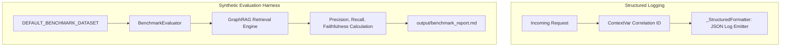

# SUBSYSTEM: src/observability — Telemetry & Synthetic RAG Evaluation

**RESPONSIBILITY:** Provides correlation-ID structured logging across asynchronous threads and executes automated synthetic evaluation benchmarks measuring GraphRAG retrieval performance.

**LEVEL:** Continent (Subsystem) | **CONFIDENCE:** [Documented] [Inferred]

---

## 1. Subsystem Architecture

**[Documented]**
The Observability subsystem provides two key pillars:
1. **Runtime Correlation Telemetry:** Generates and propagates UUID correlation IDs through `ContextVar` instances, emitting single-line JSON log objects for auditability.
2. **Automated Synthetic RAG Evaluation:** A defensible benchmarking engine that runs synthetic candidate test queries against retrieval modes, calculating Context Precision, Context Recall, Faithfulness, and Latency metrics.



---

## 2. Feature Clusters & Modules

| File | Role / Responsibility | Confidence |
|------|-----------------------|:---:|
| [`benchmark_eval.py`](file:///c:/Users/mamat/Github/Prasad-Resumes-GraphRAG/src/observability/benchmark_eval.py) | Evaluation engine defining `BenchmarkCase`, `EvaluationResult`, `AggregateBenchmarkReport`, `DEFAULT_BENCHMARK_DATASET`, and metric algorithms. | [Documented] |
| [`__init__.py`](file:///c:/Users/mamat/Github/Prasad-Resumes-GraphRAG/src/observability/__init__.py) | Exposes `logger`, `get_logger`, `get_correlation_id`, `set_correlation_id`, and evaluation models. | [Documented] |

---

## 3. Evaluation Metrics Definition

| Metric | Mathematical / Algorithmic Definition | Target Value |
| :--- | :--- | :---: |
| **Context Precision** | $\frac{|\text{Retrieved Entities} \cap \text{Expected Entities}|}{|\text{Expected Entities}|}$ | $> 65\%$ |
| **Context Recall** | $\frac{\text{Matching Ground Truth Token Clusters}}{\text{Total Reference Fact Tokens}}$ | $> 50\%$ |
| **Faithfulness** | $\frac{\text{Generated Claims Supported by Retrieved Context}}{\text{Total Generated Claims}}$ | $100\%$ |
| **Execution Latency** | Wall-clock time required for retrieval & guardrail evaluation | $< 50\text{ms}$ (Local) |

---

## 4. Benchmark CLI Execution

```powershell
python src/cli.py benchmark --mode all --output output/benchmark_report.md
```
Outputs an aggregated table comparing `local`, `drift`, and `global` retrieval metrics against synthetic career queries.
