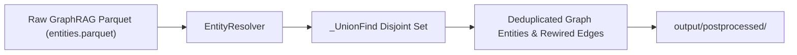

# Subsystem: `src/postprocessing` (Continent Level)

**Responsibility:** Graph entity resolution, alias merging, and relationship deduplication over GraphRAG output parquet tables.

---

## 1. Overview & Responsibility

**[Documented]** `src/postprocessing` repairs knowledge graph fragmentation caused by LLM entity extraction variances (e.g. merging `Prasad Sudhir Rane` and `Prasad Rane`, or `AWS ECS` and `Amazon ECS`). It employs a Union-Find data structure (`_UnionFind`) and rule-based similarity scoring to unify duplicate nodes and rewire graph edges.

**[Inferred]** Executing post-processing significantly improves downstream retrieval accuracy by condensing split community clusters and boosting graph centrality of core candidate concepts.

---

## 2. Key Modules & Classes

| Module / Class | File | Responsibility |
|:---|:---|:---|
| [`EntityResolver`](file:///C:/Users/mamat/Github/Prasad-Resumes-GraphRAG/src/postprocessing/entity_resolver.py) | `src/postprocessing/entity_resolver.py` | Detects candidate entity merge pairs, evaluates string distance and alias dictionaries, and executes merge operations. |
| [`_UnionFind`](file:///C:/Users/mamat/Github/Prasad-Resumes-GraphRAG/src/postprocessing/entity_resolver.py) | `src/postprocessing/entity_resolver.py` | Disjoint-set data structure providing disjoint set union and canonical representative lookups. |
| [`ResolutionPair`](file:///C:/Users/mamat/Github/Prasad-Resumes-GraphRAG/src/postprocessing/entity_resolver.py) | `src/postprocessing/entity_resolver.py` | Data class recording individual entity resolution decisions with similarity scores and rationale. |

---

## 3. Resolution Pipeline

