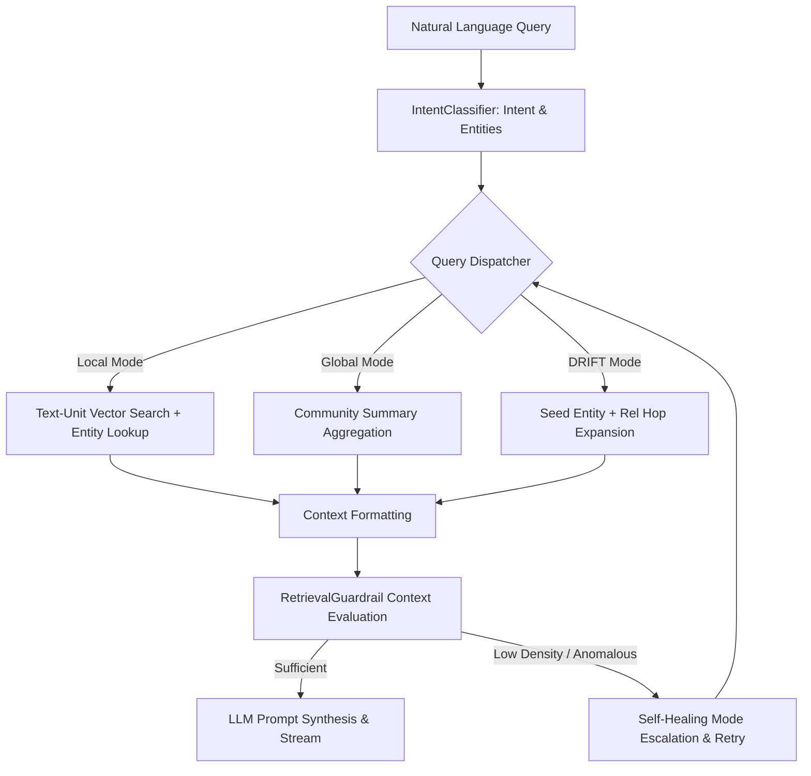

# SUBSYSTEM: src/query — GraphRAG Query Engine, Intent Router & Guardrails

**RESPONSIBILITY:** Manages query understanding, vector and relationship graph retrieval, intent classification, and pre-synthesis self-healing guardrails.

**LEVEL:** Continent (Subsystem) | **CONFIDENCE:** [Documented] [Inferred]

---

## 1. Subsystem Architecture

**[Documented]**
The Query Subsystem orchestrates incoming natural-language queries through rule-based and semantic intent classifiers, queries LanceDB vector indices and Microsoft GraphRAG Parquet artifact tables, and verifies retrieved context quality before streaming responses.

---

## 2. Feature Clusters & Modules

| File | Role / Responsibility | Confidence |
|------|-----------------------|:---:|
| [`graphrag_engine.py`](file:///c:/Users/mamat/Github/Prasad-Resumes-GraphRAG/src/query/graphrag_engine.py) | Central engine executing `_local_retrieval`, `_global_retrieval`, and `_drift_retrieval` over LanceDB/Parquet tables; hosts `retrieve_healed()` and `chat_stream()`. | [Documented] |
| [`intent_classifier.py`](file:///c:/Users/mamat/Github/Prasad-Resumes-GraphRAG/src/query/intent_classifier.py) | Classifies queries into 6 structured intents (`SKILL_LOOKUP`, `COMPANY_LOOKUP`, `EXPERIENCE_LOOKUP`, `METRICS_LOOKUP`, `COMPARATIVE_QUERY`, `GENERAL_QUERY`) and extracts canonical SME entities. | [Documented] |
| [`retrieval_guardrail.py`](file:///c:/Users/mamat/Github/Prasad-Resumes-GraphRAG/src/query/retrieval_guardrail.py) | Evaluates context quality (`ContextQualityReport`), checks token density and entity overlap, and manages multi-mode healing loops. | [Documented] |
| [`static_graph_reader.py`](file:///c:/Users/mamat/Github/Prasad-Resumes-GraphRAG/src/query/static_graph_reader.py) | High-speed, zero-infrastructure graph reader querying pre-indexed entity and relationship dictionaries for serverless execution. | [Documented] |
| [`search_engine.py`](file:///c:/Users/mamat/Github/Prasad-Resumes-GraphRAG/src/query/search_engine.py) | Hybrid search coordinator combining keyword, entity, and story-bank search routines. | [Documented] |
| [`conversation_store.py`](file:///c:/Users/mamat/Github/Prasad-Resumes-GraphRAG/src/query/conversation_store.py) | Manages in-memory and disk-persisted multi-turn chat session histories. | [Documented] |

---

## 3. Query Intent Taxonomy & Strategies

| Intent Category | Triggers & Entity Patterns | Default Strategy | Target Use-Case |
| :--- | :--- | :--- | :--- |
| **`SKILL_LOOKUP`** | Technologies, tools, frameworks, programming languages | `mode="local"`, `top_k=15`, entity boost | Specific technical competency questions |
| **`COMPANY_LOOKUP`** | Employer names, employment tenure, previous jobs | `mode="global"`, `top_k=20` | Career trajectory and company milestones |
| **`EXPERIENCE_LOOKUP`** | Projects, leadership, architecture, accomplishments | `mode="drift"`, `top_k=12` | In-depth project & story explorations |
| **`METRICS_LOOKUP`** | Numbers, scale, percentages, latency reduction, cost | `mode="local"`, `top_k=20`, metric boost | Quantified business impact verification |
| **`COMPARATIVE_QUERY`** | "Compare", "versus", multi-role comparisons | `mode="global"`, `top_k=25` | Cross-company executive comparisons |
| **`GENERAL_QUERY`** | Everything else (education, certifications, overview) | `mode="local"`, `top_k=10` | General background inquiries |

---

## 4. Self-Healing Retrieval Guardrail

**[Documented]**
When `retrieve_healed()` executes:
1. It runs the primary retrieval mode recommended by the `IntentClassifier`.
2. `RetrievalGuardrail.evaluate_context()` scores the returned text for token density (`min_tokens=30`) and entity presence.
3. If context density is insufficient, the engine executes an autonomous fallback loop (`local` $\rightarrow$ `drift` $\rightarrow$ `global`), returning the richest context and capturing a structured healing trace.
