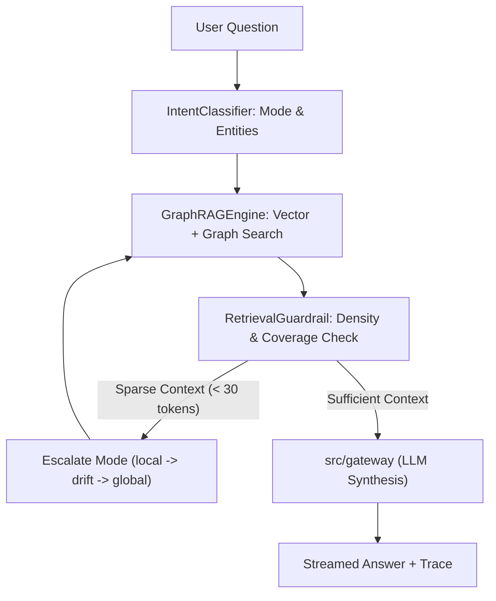

# Subsystem: `src/query` (Continent Level)

**Responsibility:** Natural language query routing, intent classification, GraphRAG retrieval engine, self-healing guardrails, and conversation persistence.

---

## 1. Overview & Responsibility

**[Documented]** `src/query` implements the primary question-answering pipeline over the indexed GraphRAG knowledge graph. It parses natural-language questions, identifies query intents (`LOCAL`, `GLOBAL`, `DRIFT`), executes multi-strategy retrieval against vector stores and Parquet graph tables, runs self-healing context evaluation (`RetrievalGuardrail`), and maintains session chat history in SQLite (`ConversationStore`).

**[Inferred]** This subsystem sits directly between the FastAPI web interface and the serverless LLM gateway, transforming raw candidate questions into grounded context packages.

---

## 2. Key Modules & Classes

| Module / Class | File | Responsibility |
|:---|:---|:---|
| [`IntentClassifier`](file:///C:/Users/mamat/Github/Prasad-Resumes-GraphRAG/src/query/intent_classifier.py) | `src/query/intent_classifier.py` | Classifies user queries into `LOCAL`, `GLOBAL`, or `DRIFT` intents with entity extraction. |
| [`RetrievalGuardrail`](file:///C:/Users/mamat/Github/Prasad-Resumes-GraphRAG/src/query/retrieval_guardrail.py) | `src/query/retrieval_guardrail.py` | Inspects retrieved context token density and triggers mode escalations if information is sparse. |
| [`GraphRAGEngine`](file:///C:/Users/mamat/Github/Prasad-Resumes-GraphRAG/src/query/graphrag_engine.py) | `src/query/graphrag_engine.py` | Loads Parquet artifacts into memory and executes local, global, and drift retrieval searches. |
| [`TTLCache`](file:///C:/Users/mamat/Github/Prasad-Resumes-GraphRAG/src/query/search_engine.py) | `src/query/search_engine.py` | In-memory thread-safe TTL cache with LRU eviction for query embeddings and search results. |
| [`ConversationStore`](file:///C:/Users/mamat/Github/Prasad-Resumes-GraphRAG/src/query/conversation_store.py) | `src/query/conversation_store.py` | SQLite-backed conversation store managing multi-turn dialogue histories. |
| `static_graph_reader` | `src/query/static_graph_reader.py` | Fast static reader accessing pre-indexed graph entities within serverless latency budgets (< 1s). |

---

## 3. Query Execution & Self-Healing Pipeline

