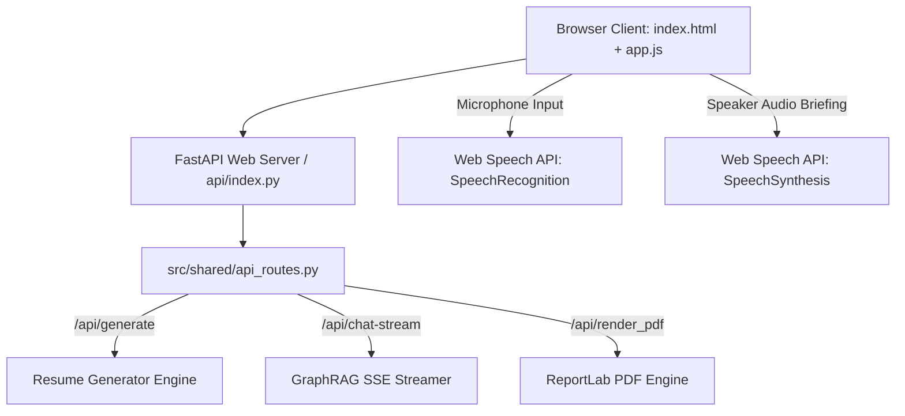

# SUBSYSTEM: src/web & src/shared — FastAPI Web Server, Voice Assistant & UI

**RESPONSIBILITY:** Serves the Material Design 3 single-page web interface, exposes unified API routes across local and Vercel serverless deployments, and powers multimodal voice interactions and live markdown/PDF editing.

**LEVEL:** Continent (Subsystem) | **CONFIDENCE:** [Documented] [Inferred]

---

## 1. Subsystem Architecture

**[Documented]**
The Web subsystem harmonizes local development (`python src/cli.py ui` running `vercel dev` or `uvicorn`) and production Vercel serverless deployments (`api/index.py`), serving static assets and handling Server-Sent Events (SSE) streaming.

---

## 2. Feature Clusters & Modules

| File | Role / Responsibility | Confidence |
|------|-----------------------|:---:|
| [`src/web/app.py`](file:///c:/Users/mamat/Github/Prasad-Resumes-GraphRAG/src/web/app.py) | Primary FastAPI application factory mounting static assets, CORS middleware, and API routers. | [Documented] |
| [`src/shared/api_routes.py`](file:///c:/Users/mamat/Github/Prasad-Resumes-GraphRAG/src/shared/api_routes.py) | Unified API endpoints (`/api/generate`, `/api/render_pdf`, `/api/save-edit`, `/api/query`, `/api/chat-stream`, `/api/default-resume`). | [Documented] |
| [`src/shared/api_models.py`](file:///c:/Users/mamat/Github/Prasad-Resumes-GraphRAG/src/shared/api_models.py) | Pydantic request and response schemas for all HTTP endpoints. | [Documented] |
| [`src/web/static/app.js`](file:///c:/Users/mamat/Github/Prasad-Resumes-GraphRAG/src/web/static/app.js) | Frontend client controller managing Tab navigation, PDF preview drawer, SSE streaming, SpeechRecognition, SpeechSynthesis, and Trace Visualizer. | [Documented] |
| [`src/web/static/index.html`](file:///c:/Users/mamat/Github/Prasad-Resumes-GraphRAG/src/web/static/index.html) | Material Design 3 single-page layout with chat search bar, voice input button, and live preview drawers. | [Documented] |
| [`src/web/static/styles.css`](file:///c:/Users/mamat/Github/Prasad-Resumes-GraphRAG/src/web/static/styles.css) | Custom CSS design tokens, pulsing recording animations, and responsive drawer layouts. | [Documented] |

---

## 3. Multimodal Features

**[Documented]**
- **Speech-to-Text Voice Query:** Microphone button in the search bar uses the browser's native `SpeechRecognition` API with real-time transcription and automatic query submission.
- **Text-to-Speech Audio Briefing:** Speaker audio toggle on assistant messages uses `SpeechSynthesis` with sanitization to read candidate summaries aloud.
- **Reasoning & Guardrail Trace:** Expandable badge under each answer reveals query intent, extracted entities, token density, and self-healing recovery traces.
