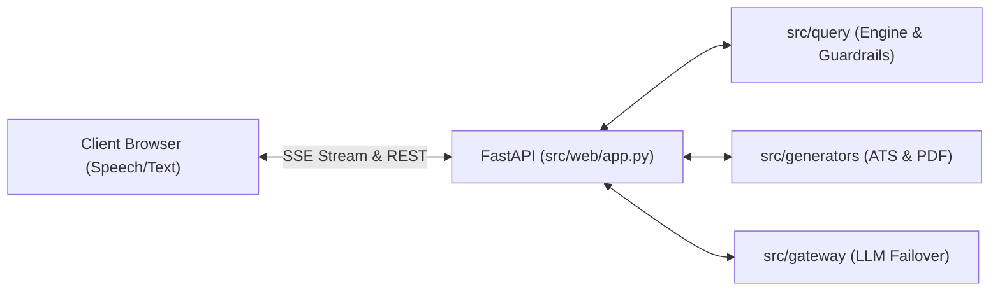

# Subsystem: `src/web` (Continent Level)

**Responsibility:** FastAPI application lifecycle, SSE stream endpoints, static UI assets, and multimodal interaction handlers.

---

## 1. Overview & Responsibility

**[Documented]** `src/web` hosts the FastAPI web server that powers the interactive web interface. It serves the HTML/CSS/JavaScript single-page application and handles Server-Sent Events (SSE) for real-time query answers (`/api/chat-stream`) and resume generation streaming (`/api/generate-stream`).

**[Inferred]** The client layer (`app.js`) features multimodal voice queries via browser `SpeechRecognition` and audio briefings via `SpeechSynthesis`, as well as interactive ATS keyword diffing and PDF previews.

---

## 2. Key Modules & Assets

| Asset / Module | File | Responsibility |
|:---|:---|:---|
| [`app.py`](file:///C:/Users/mamat/Github/Prasad-Resumes-GraphRAG/src/web/app.py) | `src/web/app.py` | FastAPI application, middleware, route registration, and SSE generators. |
| `index.html` | `src/web/static/index.html` | Main single-page application UI with tab navigation (Chat, Tailor, History). |
| `app.js` | `src/web/static/app.js` | Frontend controller, SSE client, Web Speech API integration, and DOM updates. |
| `styles.css` | `src/web/static/styles.css` | Minimalist responsive styling and theme tokens. |

---

## 3. UI Interaction Architecture

