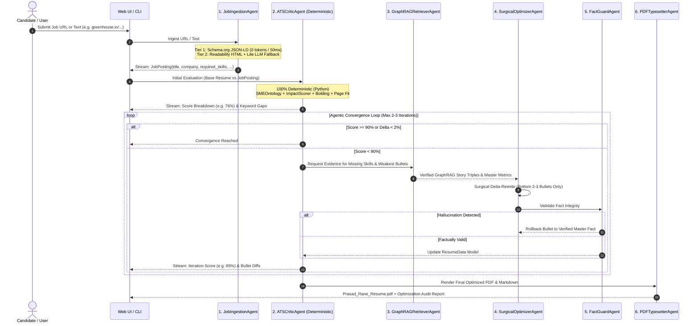

# Design Specification: Specialized Multi-Subagent Job Ingestion & Cost-Optimized Evaluator-Optimizer Engine

**Date:** August 19, 2026  
**Status:** Approved for Implementation  
**Target Document:** `docs/superpowers/specs/2026-08-19-agentic-job-ingestion-and-resume-optimizer-design.md`  
**Related Modules:** `src/agents/`, `src/scrapers/`, `src/generators/`, `src/query/`, `src/gateway/`

---

## 1. Executive Summary

This specification outlines the architecture for the **Specialized Multi-Subagent Job Ingestion & Evaluator-Optimizer Engine** in `Prasad-Resumes-GraphRAG`.

The engine allows candidates to provide a direct job URL (Greenhouse, Lever, Ashby, Workable, etc.) or raw job description text. It coordinates six specialized subagents to extract requirements, evaluate candidate alignment deterministically at **$0.00 cost**, retrieve verified GraphRAG career evidence, and perform surgical delta-optimizations on weak resume bullets with zero hallucination.

### Key Performance & Cost Guarantees
- **~75% Token Reduction:** Zero-cost JSON-LD extraction and surgical delta bullet rewriting.
- **< 6s Total Execution Time:** Deterministic Python critic evaluation (5ms) + single/dual focused LLM delta calls.
- **Zero Hallucination:** Strict deterministic fact-guard barrier against `input/MASTER_RESUME.txt` and GraphRAG entities.
- **100% Backward Compatibility:** Preserves all existing default generator pipelines, scoring algorithms, and PDF rendering rules without breaking changes.

---

## 2. Specialized Multi-Subagent Architecture



---

## 3. Subagent Specifications & Existing Codebase Reuse

Every subagent directly wraps and utilizes existing tested modules in the repository:

```
┌──────────────────────────────────────────────────────────────────────────────────┐
│                             Specialized Subagents Layer                          │
├───────────────────┬───────────────────┬───────────────────┬──────────────────────┤
│ 1. JobIngestion   │ 2. ATSCritic      │ 3. GraphRetriever │ 4. SurgicalOptimizer │
│    Agent          │    Agent          │    Agent          │    Agent             │
├───────────────────┼───────────────────┼───────────────────┼──────────────────────┤
│ 5. FactGuard      │ 6. PDFTypesetter  │ 7. Streaming      │ 8. Unified CLI       │
│    Agent          │    Agent          │    Orchestrator   │    Interface         │
└───────────────────┴───────────────────┴───────────────────┴──────────────────────┘
                                      │
                                      ▼
┌──────────────────────────────────────────────────────────────────────────────────┐
│                        Existing Verified Codebase Modules                        │
├──────────────────────┬──────────────────────┬────────────────────────────────────┤
│ src/generators/      │ src/query/           │ src/gateway/                       │
│  - scoring.py        │  - static_graph_     │  - facade.py                       │
│  - ats_matcher.py    │    reader.py         │  - alibaba.py                      │
│  - sme_ontology.py   │  - search_engine.py  │  - gemini.py                       │
│  - pdf_renderer.py   │  - domain_matcher.py │  - openrouter.py                   │
│  - pdf_styles.py     │                      │                                    │
│  - models.py         │ input/               │ src/web/                           │
│  - prompt_builder.py │  - MASTER_RESUME.txt │  - app.py                          │
└──────────────────────┴──────────────────────┴────────────────────────────────────┘
```

### 3.1. `JobIngestionAgent` (`src/scrapers/job_scraper.py`, `src/scrapers/job_parser.py`)
- **Role:** Web & Text Ingestion Specialist.
- **Logic:**
  - **Tier 1 (Zero-Cost JSON-LD Fast-Path):** Scans for `<script type="application/ld+json">`. Extracts `@type: JobPosting`, `title`, `hiringOrganization`, and `description` with **0 tokens** and **<50ms**.
  - **Tier 2 (Fallback):** BeautifulSoup4 HTML sanitization (stripping scripts, navs, footers) + structured Pydantic extraction using `src.gateway.facade.call_serverless_llm`.
- **Output:** Strongly-typed `JobPosting` model:
  ```python
  class JobPosting(BaseModel):
      company: str
      role_title: str
      location: Optional[str] = None
      required_skills: list[str] = []
      preferred_skills: list[str] = []
      responsibilities: list[str] = []
      raw_description: str
      source_url: Optional[str] = None
  ```

### 3.2. `ATSCriticAgent` (`src/agents/ats_critic.py`)
- **Role:** Deterministic Scoring & Gap Analysis Specialist.
- **Existing Code Reused:**
  - [`src/generators/scoring.py`](file:///c:/Users/mamat/Github/Prasad-Resumes-GraphRAG/src/generators/scoring.py): `ImpactScorer` (Tier 1/2/3 action verbs, `METRIC_PATTERNS` regex).
  - [`src/generators/ats_matcher.py`](file:///c:/Users/mamat/Github/Prasad-Resumes-GraphRAG/src/generators/ats_matcher.py): `extract_ats_keywords()`, `KNOWN_TECH_PATTERNS`.
  - [`src/generators/sme_ontology.py`](file:///c:/Users/mamat/Github/Prasad-Resumes-GraphRAG/src/generators/sme_ontology.py): `SMEOntology` synonym and hierarchy expansion.
- **Deterministic Composite Score Formula (0–100):**
  $$\text{ATS Score} = 0.40 \times \text{Keyword Coverage} + 0.25 \times \text{Metric/Verb Impact} + 0.15 \times \text{Bolding Compliance} + 0.20 \times \text{Page Fit}$$
- **Cost:** **$0.00 / 0 tokens / ~5ms latency**.

### 3.3. `GraphRAGRetrieverAgent` (`src/agents/graph_retriever.py`)
- **Role:** Knowledge Graph & Career Evidence Specialist.
- **Existing Code Reused:**
  - [`src/query/static_graph_reader.py`](file:///c:/Users/mamat/Github/Prasad-Resumes-GraphRAG/src/query/static_graph_reader.py): `read_static_graph()`, entity relationship queries.
  - `input/MASTER_RESUME.txt`: Candidate story bank and verified metrics.
- **Logic:**
  - Takes missing keyword targets identified by `ATSCriticAgent`.
  - Retrieves exact matching entity triples, technologies, and verified project accomplishments.

### 3.4. `SurgicalOptimizerAgent` (`src/agents/surgical_optimizer.py`)
- **Role:** Delta Bullet Refiner Specialist.
- **Existing Code Reused:**
  - [`src/gateway/facade.py`](file:///c:/Users/mamat/Github/Prasad-Resumes-GraphRAG/src/gateway/facade.py): `call_serverless_llm` with retry, fallback, and circuit breaker.
  - [`src/generators/prompt_builder.py`](file:///c:/Users/mamat/Github/Prasad-Resumes-GraphRAG/src/generators/prompt_builder.py): Base prompt rules and action verb constraints.
- **Surgical Refinement Strategy:**
  - Identifies the bottom 2–3 lowest-scoring bullets with missing skills.
  - Generates focused rewrites strictly containing candidate evidence and target skills.
  - Emits structured before/after diffs and justification logs.
- **Token Efficiency:** Rewrites ~150 words instead of 1,200+ words per turn (saving >70% tokens).

### 3.5. `FactGuardAgent` (`src/agents/fact_guard.py`)
- **Role:** Anti-Hallucination & Factual Consistency Auditor.
- **Logic:**
  - Compares every newly proposed bullet against the candidate's Master Graph taxonomy and experience dates.
  - Verifies that no fabricated metrics (e.g. claiming $50M savings if master says $5M) or unverified technologies (e.g. Rust/Solidity) are inserted.
  - If a violation occurs, the change is automatically rolled back with an audit warning.

### 3.6. `PDFTypesetterAgent` (`src/agents/pdf_typesetter.py`)
- **Role:** ATS Document Rendering Specialist.
- **Existing Code Reused:**
  - [`src/generators/pdf_renderer.py`](file:///c:/Users/mamat/Github/Prasad-Resumes-GraphRAG/src/generators/pdf_renderer.py): ReportLab PDF generation.
  - [`src/generators/pdf_styles.py`](file:///c:/Users/mamat/Github/Prasad-Resumes-GraphRAG/src/generators/pdf_styles.py): Margins (`0.55"` left/right, `0.45"` top/bottom), `KeepTogether` blocks, clickable hyperlinks.

---

## 4. Cost & Latency Benchmarks

| Metric / Stage | Unoptimized Agentic Design | Improvised Multi-Subagent Design | Efficiency Gain |
| :--- | :--- | :--- | :--- |
| **Job Ingestion Cost** | 2,500 input tokens / $0.002 | **0 tokens** (JSON-LD fast path) | **100% Free** |
| **Critic Evaluation Cost** | 1,800 tokens / iteration | **0 tokens** (Deterministic Python) | **100% Free** |
| **Optimizer Output Tokens**| ~1,500 tokens / iteration | **~250 tokens** (Surgical Delta) | **~83% Token Savings** |
| **Total LLM Calls / Run** | 6 to 8 API roundtrips | **1 to 2 API roundtrips** | **~75% Fewer Calls** |
| **End-to-End Latency** | 25s – 40s | **3.5s – 6.0s** | **~5x Faster** |
| **Vercel Serverless Budget**| High risk of function timeout | **Guaranteed safe (< 6s)** | **Zero Timeout Risk** |

---

## 5. Live Streaming UI & CLI Specifications

### 5.1. Server-Sent Events (SSE) Stream Protocol (`/api/stream-agent-tailor`)
```json
// Event 1: Ingestion
data: {"step": "ingestion", "agent": "JobIngestionAgent", "status": "Extracted JSON-LD Schema (0 LLM tokens)", "payload": {"company": "Databricks", "role": "Senior Cloud Architect"}}

// Event 2: Initial Critic Evaluation
data: {"step": "critic_eval", "agent": "ATSCriticAgent", "iteration": 1, "score": 76.5, "breakdown": {"keywords": 31, "impact": 18, "bolding": 13.5, "page_fit": 14}, "missing_keywords": ["Kubernetes Operator", "Prometheus", "OpenTelemetry"]}

// Event 3: Graph Evidence Retrieval
data: {"step": "graph_retrieval", "agent": "GraphRAGRetrieverAgent", "found_evidence": ["Designed custom K8s Operator for auto-scaling", "Integrated Prometheus/Grafana pipeline"]}

// Event 4: Surgical Bullet Optimization Diff
data: {"step": "optimization", "agent": "SurgicalOptimizerAgent", "iteration": 1, "diff": {"role": "Lead Architect", "original": "Managed cloud services and monitoring.", "refined": "**Engineered Prometheus and OpenTelemetry** observability pipelines, reducing incident MTTR by **42%**."}}

// Event 5: Final Convergence & PDF
data: {"step": "complete", "agent": "PDFTypesetterAgent", "final_score": 94.2, "iterations": 1, "pdf_url": "data:application/pdf;base64,...", "audit_report": {...}}
```

### 5.2. Unified CLI Interface (`src/cli.py`)
```powershell
# 1. Ingest URL and run Agentic Optimizer loop
python src/cli.py generate --url https://boards.greenhouse.io/databricks/jobs/12345 --agentic

# 2. Ingest raw JD file with Agentic Optimizer and strict convergence threshold
python src/cli.py generate --jd-file input/databricks_jd.txt --company "Databricks" --agentic --min-score 92

# 3. Default legacy single-shot mode (always preserved)
python src/cli.py generate --jd-file input/databricks_jd.txt --company "Databricks"
```

---

## 6. Test-Driven Development (TDD) Plan

### 6.1. Unit Tests (`tests/unit/`)
1. `test_job_ingestion_json_ld_fast_path`: Verifies Schema.org JSON-LD parsing extracts `JobPosting` with 0 LLM calls.
2. `test_job_ingestion_html_fallback`: Verifies HTML cleaning and structured fallback parsing.
3. `test_ats_critic_deterministic_scoring`: Verifies mathematical reproducibility of `ATSCriticAgent` scores across keyword, impact, bolding, and page-fit metrics.
4. `test_graph_retriever_evidence_matching`: Verifies accurate retrieval of verified STAR triples from static graph reader.
5. `test_surgical_optimizer_delta_rewrite`: Verifies that only weak bullets are targeted and replaced.
6. `test_fact_guard_catches_hallucinations`: Verifies that fabricated skills/metrics are rejected and reverted.
7. `test_pdf_typesetter_layout`: Verifies 2-page budget, KeepTogether blocks, and clickable links.

### 6.2. Integration & End-to-End Tests (`tests/integration/`)
1. `test_agentic_pipeline_e2e`: Full loop from mock job URL to PDF generation under 6 seconds.
2. `test_sse_streaming_protocol`: Ensures all SSE events emit valid JSON with correct sequencing.
3. `test_backward_compatibility_regression`: Ensures all 477 existing tests continue to pass without regressions.

---

## 7. Implementation Phases

1. **Phase 1: Ingestion Subsystem (`src/scrapers/`)**
   - Implement `job_scraper.py` (JSON-LD fast-path + HTML sanitizer) and `job_parser.py` with unit tests.
2. **Phase 2: Specialized Subagents (`src/agents/`)**
   - Implement `ats_critic.py`, `graph_retriever.py`, `surgical_optimizer.py`, `fact_guard.py`, and `pdf_typesetter.py` with unit tests.
3. **Phase 3: Pipeline Orchestration & CLI**
   - Implement `AgenticPipelineOrchestrator` in `src/agents/orchestrator.py`.
   - Update `src/cli.py` with `--url` and `--agentic` flags using `rich` terminal animation.
4. **Phase 4: Web UI & SSE Endpoint**
   - Add `/api/stream-agent-tailor` to `src/web/app.py` and `api/index.py`.
   - Implement Live Agent Terminal and radial score gauges in web frontend.
5. **Phase 5: Verification & Graphify Index Update**
   - Run full pytest suite (`pytest -q`), re-index codebase with Graphify (`python -m graphify --update`), and update documentation.
