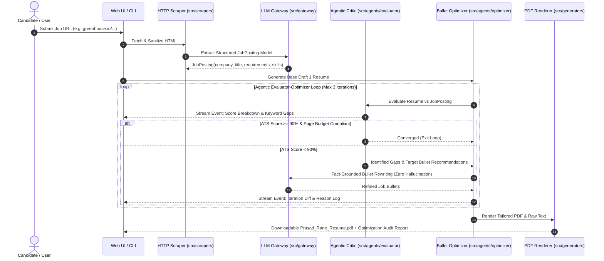

# Design Specification: Agentic Job Posting Ingestion & Evaluator-Optimizer Engine

**Date:** August 19, 2026  
**Status:** Ready for Review  
**Target Location:** `docs/superpowers/specs/2026-08-19-agentic-job-ingestion-and-resume-optimizer-design.md`

---

## 1. Executive Summary

This feature introduces an end-to-end **Agentic Job Ingestion and Evaluator-Optimizer Engine** into the Prasad-Resumes-GraphRAG platform. It allows users to provide a direct job URL (Greenhouse, Lever, Ashby, Workday, LinkedIn, or any generic webpage) or raw text, extracts structured job requirements, and utilizes an autonomous multi-iteration agentic critic/optimizer loop to synthesize, evaluate, and refine an ATS-optimized, 2-page candidate resume with live, animated UI thinking streams.

---

## 2. Architecture & Data Flow



---

## 3. Subsystem Breakdown

### 3.1. Job Ingestion Subsystem (`src/scrapers/`)
- **`job_scraper.py`**:
  - Direct HTTP fetcher with standard browser User-Agents and configurable timeouts.
  - HTML sanitizer stripping boilerplate (navs, footers, cookie banners, scripts, styles).
  - Clean plaintext / markdown extraction using BeautifulSoup4 and readability heuristics.
- **`job_parser.py`**:
  - LLM-assisted metadata and requirements extractor using `src.gateway.facade`.
  - Maps dirty text into a strongly-typed Pydantic model:
    ```python
    class JobPosting(BaseModel):
        company: str
        role_title: str
        location: Optional[str] = None
        required_skills: list[str] = []
        preferred_skills: list[str] = []
        responsibilities: list[str] = []
        raw_description: str
        source_url: Optional[str] = None
    ```

### 3.2. Agentic Evaluator-Optimizer Subsystem (`src/agents/`)
- **`evaluator.py` (The Critic Agent)**:
  - Assesses draft resume against `JobPosting`.
  - Calculates composite **ATS Readiness Score (0-100)**:
    - **Keyword Coverage (40%)**: Ratio of required/preferred hard skills present.
    - **Impact & Action Verbs (25%)**: Percentage of bullets featuring quantifiable metrics (%, $, latency, scale) and strong action verbs.
    - **Bolding Compliance (15%)**: Strict <20% bold character cap, max 3 bold phrases per bullet.
    - **Page Fit & Density (20%)**: Precise 2-page budget compliance without overflow.
- **`optimizer.py` (The Refiner Agent)**:
  - Identifies weak bullets with lowest keyword density or metric strength.
  - Generates fact-grounded rewrites strictly anchored in the candidate's verified graph/master resume stories.
  - Emits diffs and reasoning rationale per iteration.
- **`models.py`**:
  - `OptimizationIteration`, `CriticEvaluationReport`, `AgentThoughtEvent`, `OptimizationResult`.

### 3.3. Live Streaming & UI/UX Experience
- **Backend Streaming Endpoint (`api/index.py` & `src/server.py`)**:
  - SSE (Server-Sent Events) endpoint `/api/stream-agent-tailor` streaming chunked JSON events:
    - `{"type": "status", "message": "Scraping Greenhouse job posting..."}`
    - `{"type": "thought", "reasoning": "Detected missing key terms: 'Kubernetes Operator', 'Prometheus'..."}`
    - `{"type": "iteration_score", "iteration": 1, "score": 76, "breakdown": {...}}`
    - `{"type": "bullet_diff", "role": "Lead Architect", "before": "...", "after": "..."}`
    - `{"type": "complete", "final_score": 94, "pdf_url": "..."}`
- **Web UI Frontend**:
  - **Live Agent Terminal**: Dark-themed terminal card with glowing pulsing indicator and streaming thought reasoning.
  - **Animated Metric Gauges**: Radial circular score meter tracking score climb (76% ➔ 88% ➔ 94%).
  - **Interactive Iteration Diff Tabs**: Inspect before/after bullet rewrites with bold keyword highlighting.

### 3.4. Unified CLI Integration (`src/cli.py`)
- Extends the `generate` command:
  ```powershell
  # Generate resume directly from job URL with agentic optimizer enabled
  python src/cli.py generate --url https://boards.greenhouse.io/example/jobs/12345 --agentic
  
  # Override company name or control iteration ceiling
  python src/cli.py generate --url https://... --company "Databricks" --max-iterations 3
  ```
- Terminal UI renders rich formatted status spinners, live thought boxes, and score tables via `rich`.

---

## 4. Anti-Hallucination & Factual Guardrails

To preserve absolute resume integrity:
1. **Source Graph Truth Anchor**: The Optimizer agent is strictly constrained to candidate experiences present in `input/MASTER_RESUME.txt` and the GraphRAG entities.
2. **Fact Validation Check**: Any rewritten bullet is compared against the candidate's source stories. If a rewritten bullet introduces an unsubstantiated technology or falsified metric not present in the candidate's career history, it is rejected and rolled back.
3. **Format Integrity**: Adheres strictly to ReportLab 2-page PDF formatting rules (`0.55"` margins, KeepTogether job blocks, clickable hyperlinks, no text orphan lines).

---

## 5. Test-Driven Development (TDD) Plan

### 5.1. Unit Tests (`tests/test_scrapers.py`, `tests/test_agents.py`)
- `test_job_scraper_html_sanitization`: Verify script/nav/footer stripping and clean text output.
- `test_job_parser_llm_extraction`: Verify parsing dirty HTML into valid `JobPosting` model.
- `test_critic_evaluation_scoring`: Verify deterministic scoring of keyword coverage, metric density, and bolding caps.
- `test_optimizer_loop_convergence`: Verify that iterations stop when score >= 90% or max iterations reached.
- `test_anti_hallucination_guard`: Verify that optimizer rejects fabricated skills or dates.

### 5.2. Integration & End-to-End Tests (`tests/test_agentic_flow.py`)
- `test_cli_url_generation_e2e`: Test end-to-end run from mock job URL to PDF generation.
- `test_sse_streaming_endpoint`: Verify SSE event stream emits valid serialized JSON events in correct sequence.

---

## 6. Implementation Roadmap

1. **Phase 1: Ingestion Engine** — Build `src/scrapers/` (`job_scraper.py`, `job_parser.py`, Pydantic models) with unit tests.
2. **Phase 2: Agentic Critic & Optimizer** — Build `src/agents/` (`evaluator.py`, `optimizer.py`, guardrails) with unit tests.
3. **Phase 3: CLI Integration** — Update `src/cli.py` to support `--url` and `--agentic` with Rich terminal animations.
4. **Phase 4: Streaming Backend & Web UI** — Implement SSE endpoint in `api/index.py` and rich live agent thinking UI.
5. **Phase 5: Verification & Documentation** — Run full pytest suite, update Graphify graph index, and update user docs.
