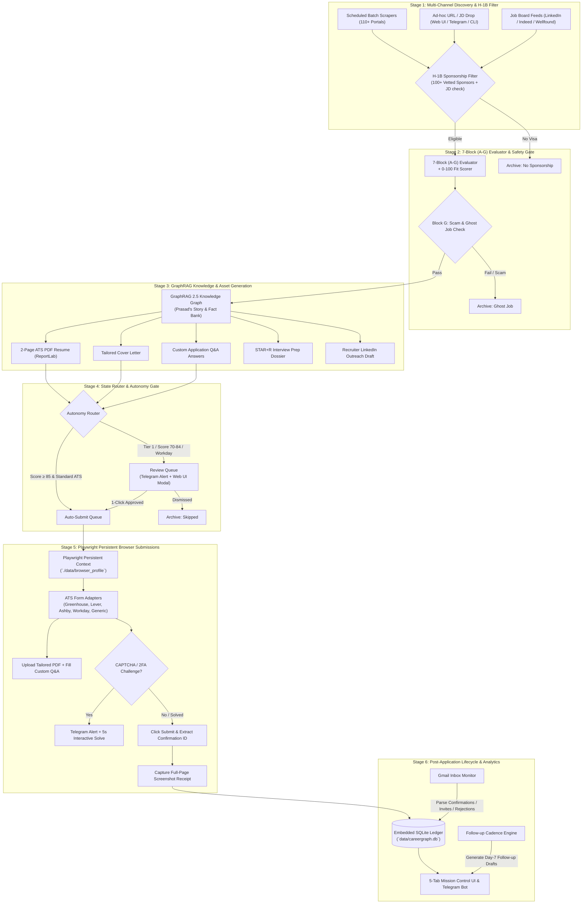

# CareerGraph AI — Autonomous Agentic Job Search, Application & Tracking Platform

**Specification & Design Document**  
**Date:** 2026-08-22  
**Target Repository Path:** `C:\Users\mamat\Github\CareerGraph-AI`  
**Status:** Approved for Implementation Planning  
**Target Platform:** Python 3.11+, Playwright, GraphRAG 2.5, SQLite, FastAPI, Tailwind CSS  

---

## 1. Executive Summary & Vision

**CareerGraph AI** is an autonomous AI agentic platform that eliminates manual job hunting by unifying job discovery, H-1B sponsorship filtering, 7-block candidate fit evaluation, GraphRAG-grounded ATS resume & cover letter generation, Playwright persistent browser auto-submission, and post-application Gmail lifecycle tracking into a single, clean-slate repository at `C:\Users\mamat\Github\CareerGraph-AI`.

The system is constructed with a clean slate by harvesting and consolidating proven, battle-tested components from sibling repositories in `C:\Users\mamat\Github`:
- **`Prasad-Resumes-GraphRAG`**: GraphRAG 2.5 story/fact graph, multi-provider LLM gateway (Gemini/OpenRouter/Alibaba), strict 2-page ATS PDF renderer, ATS keyword matcher.
- **`autopilot-jobhunt`**: 110+ careers portal scrapers, 100+ H-1B sponsor dataset, Prasad-specific 0–100 scoring prompt, Telegram bot alerts.
- **`job-auto-apply-bot`**: Playwright ATS form adapters (Greenhouse, Lever, Workday, Generic), Google/Gmail OAuth watcher.
- **`career-ops`**: 7-Block (A–G) evaluation rubric, Block G scam & ghost-job detector, 7-day follow-up cadence, portal configs (`portals.yml`).
- **`Tech-Job-Resume-Writer` (JobPilot)**: Relational schema patterns, clean architecture separation.

---

## 2. Core Architectural Principles

1. **Clean-Slate Monorepo in `CareerGraph-AI`:** Dedicated repository with no legacy baggage, unified virtual environment, and strict TDD pytest suite.
2. **Zero-Waste Reutilization:** Direct porting and standardization of ~85% of existing code from sibling repositories.
3. **Persistent Browser Context:** Playwright launches with a dedicated persistent user data directory (`./data/browser_profile`) ensuring all cookies, Workday logins, LinkedIn/Google auth sessions, and Cloudflare tokens remain permanently intact across sessions.
4. **Dual Autonomy Modes:**
   - **Full Auto-Pilot:** For standard ATS roles (Greenhouse, Lever, Ashby) with fit score ≥ 85 and verified H-1B sponsorship, the agent tailors, pre-fills, submits, and logs receipts automatically.
   - **Review Gate Mode:** For Tier 1 dream companies, fit scores between 70–84, or complex multi-step portals (Workday), the agent stages the application and alerts via Telegram / Web UI for a 1-click `[Approve & Submit]`.
5. **Strict Grounding & ATS Standards:** All resume bullet points and Q&A answers are grounded in the GraphRAG story bank with zero hallucination guarantee (`FactGuardAgent`), strict 2-page maximum budget, and ATS bolding cap <20%.
6. **Test-Driven Development (TDD):** Every stage, adapter, evaluator, and database model must have unit and integration tests written first in `tests/`.

---

## 3. System Architecture & Component Flow



---

## 4. Target Clean-Slate Package & Folder Structure (`C:\Users\mamat\Github\CareerGraph-AI`)

```
CareerGraph-AI/
├── src/
│   ├── core/                          # Core infrastructure, models, DB & gateway
│   │   ├── __init__.py
│   │   ├── config.py                  # Settings, credentials, environment loaders
│   │   ├── models.py                  # Shared Pydantic domain models & enums
│   │   ├── db/                        # SQLite persistence layer
│   │   │   ├── __init__.py
│   │   │   ├── schema.py              # SQLite table creation & migrations
│   │   │   └── repository.py          # CRUD repositories (Jobs, Applications, Artifacts)
│   │   └── gateway/                   # Multi-provider LLM gateway
│   │       ├── facade.py              # Failover router (_try_chain)
│   │       ├── gemini.py              # Direct Gemini AI Studio REST
│   │       ├── openrouter.py          # OpenRouter free pool
│   │       └── alibaba.py             # Alibaba DashScope
│   │
│   ├── pipeline/                      # 5 Chronological Pipeline Stages
│   │   ├── 1_discovery/               # Stage 1: Ingestion & Sourcing
│   │   │   ├── __init__.py
│   │   │   ├── scanner.py             # Ported from autopilot-jobhunt (110+ portals)
│   │   │   ├── h1b_checker.py         # Vetted H-1B sponsor validation
│   │   │   ├── portal_crawler.py      # Greenhouse/Lever/Ashby API crawlers (from career-ops)
│   │   │   └── adhoc_ingestor.py      # URL & pasted text intake parser
│   │   │
│   │   ├── 2_evaluation/              # Stage 2: Evaluation & Scoring
│   │   │   ├── __init__.py
│   │   │   ├── scorer.py              # 0-100 fit scorer (Prasad-specific rubric)
│   │   │   ├── rubric_evaluator.py    # 7-Block (A-G) deep evaluation
│   │   │   ├── ghost_job_detector.py  # Block G legitimacy, scam & repost detector
│   │   │   └── work_auth_guard.py     # Hard visa blocker rule engine
│   │   │
│   │   ├── 3_tailoring/               # Stage 3: GraphRAG Knowledge & Generation
│   │   │   ├── __init__.py
│   │   │   ├── graph_retriever.py     # GraphRAG 2.5 entity/story retriever
│   │   │   ├── resume_generator.py    # ATS resume bullet & summary generator
│   │   │   ├── surgical_optimizer.py  # Bold tagging (<20% cap) & action verbs
│   │   │   ├── fact_guard.py          # Zero hallucination validator
│   │   │   ├── pdf_renderer.py        # ReportLab 2-page strict ATS PDF renderer
│   │   │   ├── pdf_styles.py          # Exact ATS PDF styles & palette
│   │   │   ├── cover_letter.py        # Tailored cover letter generator
│   │   │   ├── qa_generator.py        # Custom application form Q&A drafter
│   │   │   └── outreach_drafter.py    # Recruiter LinkedIn outreach generator
│   │   │
│   │   ├── 4_submission/              # Stage 4: Playwright Persistent Submitter
│   │   │   ├── __init__.py
│   │   │   ├── browser_manager.py     # Persistent context launcher (`user_data_dir`)
│   │   │   ├── captcha_handler.py     # Cloudflare/2FA detection & interactive handoff
│   │   │   ├── submitter_engine.py    # Orchestration loop with screenshot capture
│   │   │   └── adapters/              # ATS Form Adapters (from job-auto-apply-bot)
│   │   │       ├── base_adapter.py    # Abstract adapter interface
│   │   │       ├── greenhouse.py      # Greenhouse boards & embedded iframes
│   │   │       ├── lever.py           # Lever hiring forms
│   │   │       ├── ashby.py           # Ashby application forms
│   │   │       ├── workday.py         # Workday multi-step account & job wizard
│   │   │       └── generic.py         # Heuristic fallback form filler
│   │   │
│   │   └── 5_lifecycle/               # Stage 5: Tracking & Intelligence
│   │       ├── __init__.py
│   │       ├── gmail_watcher.py       # Gmail OAuth inbox reader (confirmations/rejections)
│   │       ├── followup_engine.py     # 7-Day cadence calculator & follow-up drafter
│   │       └── funnel_analytics.py    # Conversion rates, latency & ATS stats
│   │
│   └── interface/                     # User Interaction Surfaces
│       ├── cli/                       # CLI commands (`scan`, `apply`, `submit`, `daemon`, `ui`)
│       ├── bot/                       # Telegram interactive bot (alerts, 1-click approve)
│       └── api/                       # FastAPI endpoints serving Web Mission Control
│
├── data/
│   ├── browser_profile/               # Persistent browser session data (gitignored)
│   ├── careergraph.db                 # Local SQLite database (gitignored)
│   ├── h1b_sponsors.json              # 100+ vetted H-1B sponsors (from autopilot-jobhunt)
│   ├── companies.yaml                 # Company watchlist & portal configurations
│   └── graphrag_index/                # Pre-indexed GraphRAG entities & story bank
│
├── output/
│   ├── resumes/                       # Tailored 2-page ATS PDFs
│   ├── cover_letters/                 # Generated cover letters
│   └── receipts/                      # Timestamped full-page submission screenshots
│
├── tests/                             # Comprehensive TDD pytest suite
│   ├── unit/                          # Unit tests for each pipeline stage
│   ├── integration/                   # End-to-end integration & mock browser tests
│   └── fixtures/                      # Mock JDs, HTML forms, and API responses
│
├── web/                               # Mission Control Web Dashboard (Tailwind/HTML/JS)
├── requirements.txt                   # Production dependencies
├── pyproject.toml                     # Package definition
└── README.md                          # Quick start, architecture & usage guide
```

---

## 5. SQLite Data Model & State Machine

```sql
-- 1. Jobs Table
CREATE TABLE IF NOT EXISTS jobs (
    id TEXT PRIMARY KEY,                       -- MD5(company + title + url)
    company TEXT NOT NULL,
    title TEXT NOT NULL,
    url TEXT UNIQUE NOT NULL,
    portal_type TEXT NOT NULL,                 -- greenhouse, lever, ashby, workday, generic
    location TEXT,
    description_raw TEXT,
    salary_range TEXT,
    h1b_status TEXT DEFAULT 'unknown',         -- confirmed, unknown, no_sponsorship
    source TEXT NOT NULL,                      -- scraped_nightly, ad_hoc_ui, telegram
    status TEXT NOT NULL,                      -- discovered, evaluating, tailoring, ready_for_review, auto_submitting, submitted, archived
    created_at TIMESTAMP DEFAULT CURRENT_TIMESTAMP,
    updated_at TIMESTAMP DEFAULT CURRENT_TIMESTAMP
);

-- 2. Evaluations Table
CREATE TABLE IF NOT EXISTS evaluations (
    job_id TEXT PRIMARY KEY REFERENCES jobs(id) ON DELETE CASCADE,
    overall_score REAL NOT NULL,               -- 0.0 to 100.0
    fit_reason TEXT NOT NULL,
    block_a_summary TEXT,                      -- JSON
    block_b_cv_match TEXT,                     -- JSON
    block_c_strategy TEXT,
    block_d_comp TEXT,
    block_e_angle TEXT,
    block_f_stories TEXT,                      -- JSON array of STAR+R story IDs
    block_g_legitimacy REAL DEFAULT 100.0,
    work_auth_blocker INTEGER DEFAULT 0,       -- 1 if explicit no-visa clause
    evaluated_at TIMESTAMP DEFAULT CURRENT_TIMESTAMP
);

-- 3. Artifacts Table
CREATE TABLE IF NOT EXISTS artifacts (
    id TEXT PRIMARY KEY,
    job_id TEXT UNIQUE REFERENCES jobs(id) ON DELETE CASCADE,
    resume_pdf_path TEXT NOT NULL,
    resume_markdown TEXT NOT NULL,
    cover_letter_path TEXT,
    form_answers TEXT,                         -- JSON map of questions -> tailored answers
    outreach_note TEXT,                        -- LinkedIn recruiter note (<=300 chars)
    generated_at TIMESTAMP DEFAULT CURRENT_TIMESTAMP
);

-- 4. Applications (Submissions & Tracking) Table
CREATE TABLE IF NOT EXISTS applications (
    id TEXT PRIMARY KEY,
    job_id TEXT UNIQUE REFERENCES jobs(id) ON DELETE CASCADE,
    submission_mode TEXT NOT NULL,             -- full_autopilot, user_approved
    submitted_at TIMESTAMP,
    receipt_screenshot_path TEXT,
    confirmation_number TEXT,
    followup_due_date DATE,
    followup_draft TEXT,
    gmail_thread_id TEXT,
    current_stage TEXT NOT NULL,               -- submitted, acknowledged, interview, offer, rejected
    notes TEXT,
    updated_at TIMESTAMP DEFAULT CURRENT_TIMESTAMP
);
```

---

## 6. Persistent Browser Subsystem & ATS Adapters

- **Engine:** Playwright Python with `playwright-stealth`.
- **Browser Profile:** Dedicated `./data/browser_profile` directory storing session cookies, Workday logins, LinkedIn/Google OAuth tokens.
- **ATS Form Adapters:**
  1. `GreenhouseAdapter`: Handles `boards.greenhouse.io`, file attachments, custom questions.
  2. `LeverAdapter`: Handles `jobs.lever.co`, input fills, PDF uploads, social URLs.
  3. `AshbyAdapter`: Handles `ashbyhq.com`, dynamic elements, custom inputs.
  4. `WorkdayAdapter`: Navigates multi-step account login and multi-page application wizard.
  5. `GenericAdapter`: Fallback heuristic form filler.

---

## 7. Interactive CAPTCHA, 2FA & Review Gates

- **CAPTCHA / 2FA Detection:** Instant Telegram alert + focuses browser window for a 5-second human solve, then auto-resumes.
- **Review Gate:** Dispatches Telegram inline buttons (`[✅ 1-Click Submit]`, `[📄 View PDF]`, `[❌ Dismiss]`) + Web UI modal for Tier 1 roles.

---

## 8. Mission Control Web UI (5-Tab Dashboard)

FastAPI backend serving static Tailwind UI:
1. **Pipeline Kanban Board** (`Discovered` ➔ `Review` ➔ `Submitting` ➔ `Applied` ➔ `Interview` ➔ `Offer`).
2. **Quick Apply Bar** (Instant URL drop ➔ instant score + PDF preview + 1-click submit).
3. **GraphRAG Story Explorer** (Browse story bank, metrics, and entity graph).
4. **Agent Live Mission Control** (Live terminal logs, active Playwright runs, CAPTCHA alerts).
5. **Autonomy & Watchlist Config** (Threshold settings, H-1B toggle, Telegram config).
